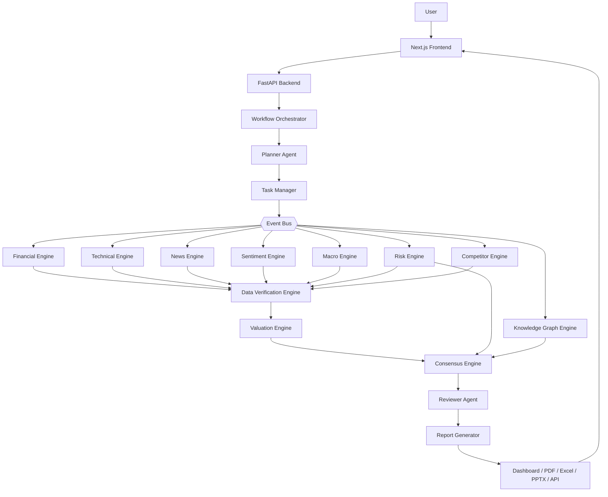
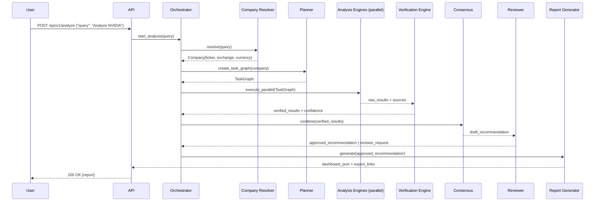
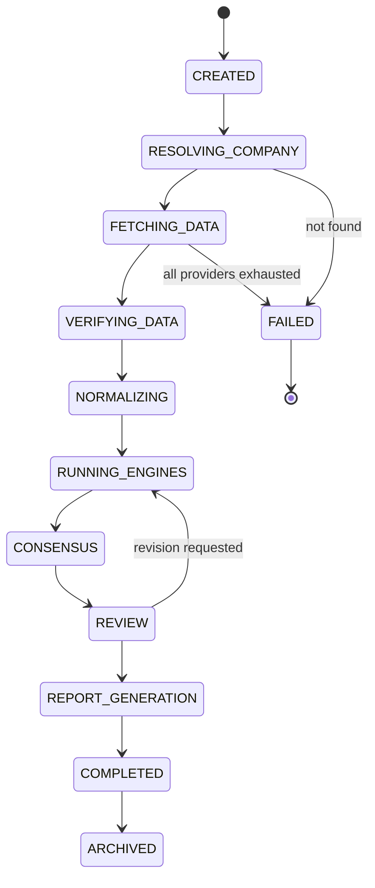
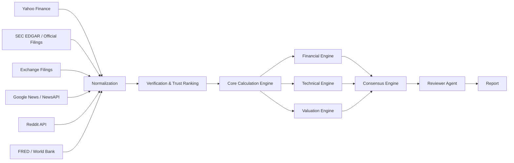

# InvestorGPT
## Autonomous, Explainable, Multi-Agent Investment Research Platform

**Document Type:** Technical Architecture & Product Specification
**Version:** 1.1 (Founder / Engineering Edition — Expanded)
**Classification:** Internal Technical Specification — Open Build
**Volume:** 1 of 8 — Vision & Complete System Overview

---

## Revision History

**Table 1.1 — Document Revision History**

| Version | Date | Author | Changes |
|---|---|---|---|
| 0.1 | Design Phase | Project Owner + AI Design Partner | Initial brainstorm: agent concept, data verification philosophy |
| 0.5 | Design Phase | Project Owner + AI Design Partner | Added Financial, Technical, Valuation, News/Risk/Macro engines |
| 0.8 | Design Phase | Project Owner + AI Design Partner | Added Consensus Engine, Investment Committee, UI/UX, Engineering Blueprint |
| 0.9 | Design Phase | Project Owner + AI Design Partner | Added Enterprise hardening: Event Bus, State Machine, Plugin SDK, Evaluation Framework, Rule Engine, Orchestrator, Queue/Worker layer |
| 1.0 | Documentation Pass 1 | Documentation Pass | Consolidated into 7-volume formal technical specification with diagrams, schemas, and code |
| 1.1 | Documentation Pass 2 | Documentation Pass | Added numbered figures/tables, expanded Frontend & Roadmap, added Volume 8 (Glossary, Figure/Table Index, Extended Reference) |

---

## Executive Summary

### The Problem

Retail investors and even many professionals face three compounding problems when researching a stock:

1. **Data fragmentation** — financial statements, news, technical charts, transcripts, and sentiment all live in different tools.
2. **Trust** — most AI stock tools let a language model "decide" numbers (P/E, DCF, RSI) directly, which means hallucinated figures are presented with full confidence.
3. **Opacity** — a single "BUY" output with no visible reasoning, no sources, and no way to challenge the conclusion.

### The Solution

**InvestorGPT** is a multi-agent AI system that behaves like a junior equity research team rather than a chatbot. A single query — `Analyze NVIDIA` — triggers a pipeline that:

- Resolves the company across global exchanges,
- Pulls financial, technical, news, sentiment, and macroeconomic data from multiple independent providers,
- Cross-verifies every number before it is used,
- Runs **all calculations in deterministic Python code**, never in the language model,
- Produces fundamental, technical, valuation, and risk analysis in parallel,
- Combines the results through a transparent, vote-based **Consensus Engine**,
- Passes the output through a **Reviewer Agent** that checks math, logic, and citations,
- Renders the result as an interactive dashboard and exportable institutional-style report — every number traceable back to its original source.

### Impact

A system built this way is simultaneously:
- **More trustworthy** than a chatbot (because the LLM never invents numbers),
- **More useful** than a static financial data terminal (because it explains *why*, not just *what*),
- **More extensible** than a closed product (because every data provider, valuation model, and indicator is a swappable plugin).

### Goals of This Document

This specification gives an engineering team everything required to build InvestorGPT from an empty repository: the complete architecture, every agent's responsibility, the data-verification algorithm, the financial/technical/valuation formulas, the database schema, the API surface, the security model, the testing strategy, and a phased roadmap.

> ⚠️ **Disclaimer.** InvestorGPT is a software specification, not financial advice. See Volume 7, Part 22.7 and Volume 8, Part 25.9 for the full statement, which must be surfaced in any real deployment.

---

## Table of Contents — Full Suite (8 Volumes)

**Volume 1 (this volume)** — Part 1 Vision · Part 2 System Overview

**Volume 2 — Requirements & Architecture** — Part 3 Functional Requirements · Part 4 Non-Functional Requirements · Part 5 Architecture

**Volume 3 — AI Agent & Intelligence Layer** — Part 6 Agent Design · Part 7 LLM Integration · Part 8 Memory · Part 9 Knowledge Management (RAG/GraphRAG)

**Volume 4 — Backend, Frontend, Database, API** — Part 10 Backend · Part 11 Frontend (expanded) · Part 12 Database · Part 13 API

**Volume 5 — Algorithms, Implementation, Security** — Part 14 Algorithms · Part 15 Implementation · Part 16 Security

**Volume 6 — Infrastructure, Performance, Testing, Deployment** — Part 17 Infrastructure (+ Terraform) · Part 18 Performance · Part 19 Testing · Part 20 Deployment

**Volume 7 — Observability, Business, Roadmap, Appendices** — Part 21 Observability · Part 22 Business Model · Part 23 Roadmap (expanded) · Part 24 Appendices (summary)

**Volume 8 — Glossary, Figure/Table Index & Extended Reference (new)** — Part 25 Full Glossary · Part 26 Sample Prompt Library · Part 27 Extended Code Appendix (TypeScript/Node.js/Terraform/GraphQL) · Part 28 Master Figure Index · Part 29 Master Table Index · Part 30 References & Bibliography

---

# Part 1 — Project Vision

## 1.1 Project Identity

**Table 1.2 — Project Identity**

| Field | Value |
|---|---|
| Name | InvestorGPT |
| Tagline | *Your Autonomous AI Investment Research Analyst* |
| Category | Autonomous multi-agent AI research platform |
| License model | Open-source core, free to build and run locally |

## 1.2 Mission Statement

To give any individual investor, anywhere in the world, the same depth of verified, multi-disciplinary research that an institutional analyst would produce — automatically, transparently, and for free.

## 1.3 Problem Statement

Existing tools fall into two unsatisfying categories:

- **Data terminals** (Yahoo Finance, screeners, TradingView): rich data, zero reasoning. The user still has to do all the analytical work.
- **AI chatbots** (general-purpose LLMs asked "should I buy X?"): rich reasoning, zero verification. The model can fabricate financial figures with total confidence, and there is no way to audit *why* it said what it said.

InvestorGPT exists to occupy the gap between these two: **verified data + transparent multi-agent reasoning.**

## 1.4 Solution Overview

A user submits a single natural-language request. The system performs company resolution, parallel multi-source data collection, deterministic financial/technical/valuation computation, narrative analysis (news, sentiment, macro, risk), evidence-weighted consensus decision-making, automated self-review, and finally renders an interactive, exportable research report.

## 1.5 Core Design Philosophy

These five principles are non-negotiable and recur throughout every later volume:

**Table 1.3 — The Five Non-Negotiable Design Principles**

| # | Principle | What It Means in Practice |
|---|---|---|
| 1 | **Never hallucinate** | If verified data is unavailable, the system reports "Unavailable" — it never estimates silently. |
| 2 | **Every number has a source** | Every figure carries provenance metadata: source, retrieval timestamp, fiscal period, page reference where applicable. |
| 3 | **The LLM never calculates** | All financial/technical/valuation math runs in deterministic Python. The LLM's only job is to *explain* numbers that code has already produced. |
| 4 | **Never trust a single source** | Every important figure is cross-checked across at least two independent providers, with official filings ranked highest. |
| 5 | **Every recommendation is explainable** | A "BUY" output must always be traceable to the specific evidence (financial, technical, valuation, risk, sentiment) that produced it. |

## 1.6 Target Users & Personas

**Table 1.4 — User Personas**

| Persona | Need | How InvestorGPT Serves Them |
|---|---|---|
| Retail long-term investor | Wants a fundamentals-driven view without reading 10-Ks | Executive Summary + Fundamental/Valuation dashboards |
| Swing/technical trader | Wants multi-timeframe technical structure | Technical Analysis Engine + Trade Setup module |
| Finance/CS student (learning) | Wants to understand *why* a metric matters | "AI Learning Mode" — every metric is clickable and explained from first principles |
| Developer/researcher | Wants to extend or audit the system | Plugin SDK + Audit Mode + open architecture |
| Portfolio holder | Wants to know how one stock affects their whole portfolio | Portfolio Analyzer module |

## 1.7 Real-World Use Cases

1. `Analyze NVIDIA` → full institutional-style report in minutes.
2. `Compare NVIDIA, AMD, Broadcom` → side-by-side multi-company dashboard.
3. `Analyze Reliance` → automatic resolution to the NSE listing, with statements normalized from INR filings.
4. Re-running `Analyze NVIDIA` three months later → diffed report showing exactly what changed and why the recommendation moved.
5. Uploading a personal portfolio CSV → exposure, concentration, and correlation analysis.

## 1.8 Business Value & Innovation

The innovation is not "AI that talks about stocks" — many products do that. The innovation is the **separation of computation from language generation**, combined with a **multi-agent consensus and review process** that mirrors how real investment committees operate. This architecture is what allows the system to remain accurate even as the underlying LLM is swapped, upgraded, or replaced.

## 1.9 Competitive Landscape

**Table 1.5 — Capability Comparison**

| Capability | Bloomberg Terminal | Morningstar | Generic AI Chatbot | **InvestorGPT** |
|---|---|---|---|---|
| Verified multi-source data | ✅ | ✅ | ❌ | ✅ |
| Deterministic financial math | ✅ | ✅ | ❌ | ✅ |
| Full technical analysis suite | ✅ | ❌ | ❌ | ✅ |
| Natural-language explanations | ❌ | ❌ | ✅ | ✅ |
| Transparent, citable reasoning | ❌ | Partial | ❌ | ✅ |
| Free / self-hostable | ❌ | ❌ | Partial | ✅ |
| Extensible via plugins | ❌ | ❌ | ❌ | ✅ |

## 1.10 Success Criteria

**Table 1.6 — Success Metrics & Targets**

| Metric | Target |
|---|---|
| Data verification rate | ≥ 95% of key metrics cross-confirmed by 2+ sources |
| Hallucination rate (numbers) | 0% — enforced structurally, not just measured |
| New analysis latency | 10–30 seconds (hardware/network dependent) |
| Cached analysis latency | < 5 seconds |
| Report explainability | 100% of headline metrics clickable to source |
| Cost to run | $0 mandatory spend (free-tier APIs + self-hosted LLM) |

## 1.11 Supported Markets & Input Resolution

InvestorGPT must resolve free-text company references to a verified ticker/exchange/country/currency tuple, regardless of phrasing or market:

```text
"Apple"            → AAPL   · NASDAQ · USA   · USD
"Reliance"         → RELIANCE.NS · NSE · India · INR
"Toyota"            → 7203.T · Tokyo Stock Exchange · Japan · JPY
"Samsung"           → 005930.KS · KRX · South Korea · KRW
"005930.KS"         → (already resolved) Samsung Electronics
```

This resolution logic is specified in full in **Volume 3, Part 6.3 (Company Resolver Agent)**.

---

# Part 2 — Complete System Overview

## 2.1 High-Level Architecture

**Figure 1.1 — InvestorGPT High-Level System Architecture**



## 2.2 Subsystem Inventory

**Table 1.7 — Complete Subsystem Inventory**

| Layer | Component | Single Responsibility |
|---|---|---|
| Orchestration | Workflow Orchestrator | Owns the lifecycle of one analysis request end to end |
| Orchestration | Planner Agent | Converts a request into an ordered/parallel task graph |
| Orchestration | Task Manager | Executes the task graph, respects dependencies |
| Orchestration | Event Bus | Decouples producers/consumers of analysis events |
| Orchestration | Analysis State Machine | Tracks and persists exactly which stage an analysis is in |
| Data | Company Resolver Agent | Turns free text into a verified company identity |
| Data | Provider Adapters | One class per external data source, behind a shared interface |
| Data | Data Verification Engine | Cross-checks every metric across sources; assigns confidence |
| Data | Core Calculation Engine | Single source of truth for every formula used anywhere |
| Analysis | Financial Engine | Ratios, growth, quality score, red/positive flags |
| Analysis | Technical Engine | Indicators, patterns, SMC, Wyckoff, multi-timeframe |
| Analysis | Valuation Engine | DCF, comparables, PEG, residual income, consensus fair value |
| Analysis | News / Sentiment / Macro / Risk Engines | Narrative + qualitative analysis with confidence scoring |
| Analysis | Knowledge Graph Engine | Entity relationships (supplier/competitor/customer/macro exposure) |
| Decision | Consensus Engine | Combines every engine's independent "vote" into one recommendation |
| Decision | Rule Engine | Deterministic sanity checks before the LLM is allowed to write anything |
| Decision | Reviewer Agent | Final QA pass: math, citations, contradictions, hallucination check |
| Output | Report Generator | Builds dashboard data, PDF, Excel, PPTX exports |
| Output | Plugin Manager | Allows new indicators/providers/valuation models without core changes |
| Platform | Scheduler / Queue / Worker Pool | Background jobs, concurrency, horizontal scaling |
| Platform | Evaluation Framework | Tracks accuracy, latency, and confidence over time |

## 2.3 End-to-End Request Lifecycle

**Figure 1.2 — End-to-End Request Sequence**



## 2.4 Analysis State Machine

**Figure 1.3 — Analysis State Machine**



Every state transition is persisted (see Volume 4, Part 12 `analyses` table), so a crashed process can **resume** from its last completed state rather than restarting the entire pipeline.

## 2.5 Data Flow Overview

**Figure 1.4 — End-to-End Data Flow (Provider → Verification → Engines → Report)**



Note the key architectural rule visible in this diagram: **the AI never talks directly to the internet.** Every external byte passes through Normalization → Verification → Calculation before any agent or LLM sees it.

## 2.6 Technology Stack Summary

**Table 1.8 — Technology Stack**

| Layer | Technology |
|---|---|
| Frontend | Next.js, React, TypeScript, TailwindCSS, Plotly/Chart.js |
| Backend API | FastAPI (Python), Uvicorn |
| Orchestration | Custom Workflow Orchestrator + asyncio Task Manager |
| Relational DB | SQLite (dev) → PostgreSQL (production) |
| Cache / Queue | Redis |
| Vector DB | ChromaDB |
| Local LLMs | Ollama running Qwen / Llama family models |
| Domain models | FinBERT (financial sentiment), Sentence-Transformers (embeddings) |
| Reports | ReportLab (PDF), openpyxl (Excel), python-pptx (PowerPoint) |
| Deployment | Docker, Docker Compose (Kubernetes + Terraform optional at scale) |

## 2.7 Design Principles That Must Never Be Broken

1. One module = one responsibility.
2. Every external API sits behind an interface (Provider pattern) — nothing is called directly.
3. Every important number carries its source, fiscal period, and confidence score.
4. Every calculation is deterministic Python — never LLM arithmetic.
5. Every recommendation must cite the evidence that produced it.
6. Missing data is reported as missing — never estimated silently.
7. All modules must be independently unit-testable.
8. Cache aggressively, but only where freshness rules allow it (see Volume 2, Part 4.1).
9. Official filings outrank exchange data, which outranks aggregator APIs, which outranks community sources.
10. Every component (provider, model, indicator, valuation method, exporter) must be replaceable without touching the rest of the system.

> **Continue to Volume 2** — `InvestorGPT_02_Requirements_and_Architecture.md` — for the full functional/non-functional requirements and the detailed layered architecture.
