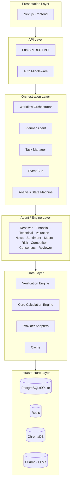
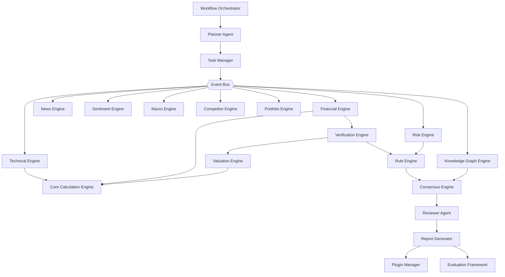
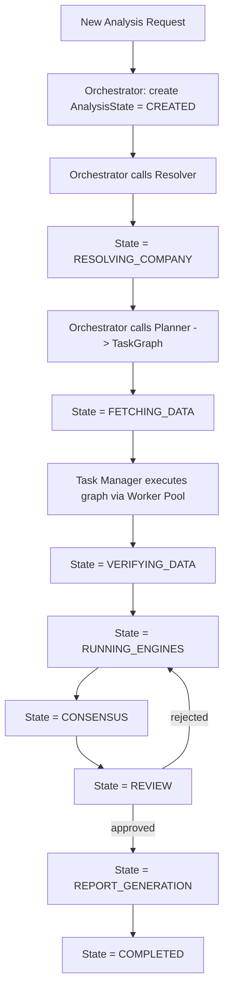
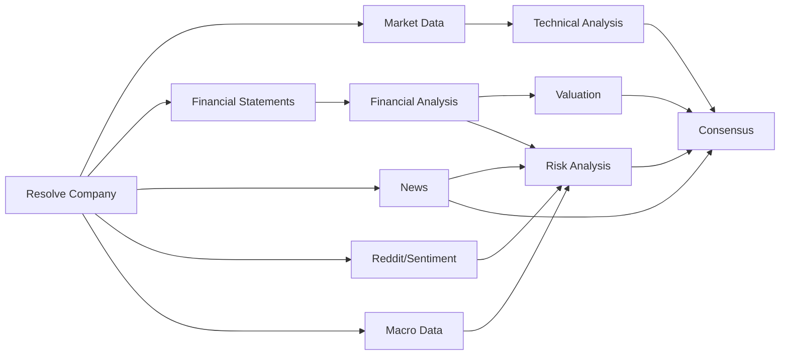

# InvestorGPT — Volume 2
## Requirements & Architecture

**Covers:** Part 3 (Functional Requirements) · Part 4 (Non-Functional Requirements) · Part 5 (Architecture)
**Previous:** `InvestorGPT_01_Vision_and_System_Overview.md` · **Next:** `InvestorGPT_03_AI_Agent_and_Intelligence_Layer.md`

---

# Part 3 — Functional Requirements

## 3.1 Requirement Numbering Convention

All functional requirements use the prefix `FR-###`. Priority follows standard MoSCoW-style mapping:

**Table 2.1 — Priority Definitions**

| Priority | Meaning |
|---|---|
| **P0** | Required for any usable MVP |
| **P1** | Required for the "v1.0 institutional-grade" experience |
| **P2** | Enterprise hardening / advanced feature, can ship later |

## 3.2 Feature Requirements Table

**Table 2.2 — Full Functional Requirements Register**

| ID | Requirement | Acceptance Criteria | Priority | Depends On |
|---|---|---|---|---|
| FR-001 | Resolve free-text company input to a verified ticker/exchange/currency | ≥ 98% accuracy on a 200-company benchmark set across 10 exchanges | P0 | — |
| FR-002 | Fetch market data (price, volume, market cap, shares outstanding) | Data returned with source + timestamp; falls back across ≥ 2 providers | P0 | FR-001 |
| FR-003 | Fetch 10 years annual + 20 quarters of financial statements | Income Statement, Balance Sheet, Cash Flow all normalized to internal schema | P0 | FR-001 |
| FR-004 | Cross-verify every key financial figure across ≥ 2 sources | Mismatches >1% flagged; official filing wins ties | P0 | FR-003 |
| FR-005 | Calculate all standard financial ratios in Python | 100% formula-based, zero LLM arithmetic, unit-tested | P0 | FR-004 |
| FR-006 | Calculate financial Quality Score and Financial Health Score | Reproducible from stored inputs; documented weighting | P1 | FR-005 |
| FR-007 | Detect financial red flags and positive signals | Each flag cites the specific metric/trend that triggered it | P1 | FR-005 |
| FR-008 | Fetch and normalize OHLCV across 9 timeframes (1m–Monthly) | Validated OHLCV before any indicator runs | P0 | FR-001 |
| FR-009 | Calculate 25+ technical indicators (trend/momentum/volume/volatility) | Each indicator reproducible from raw OHLCV via documented formula | P0 | FR-008 |
| FR-010 | Detect candlestick & chart patterns | Each detection includes confidence + invalidation level | P1 | FR-008 |
| FR-011 | Detect Smart Money Concepts (BOS, CHOCH, FVG, Order Blocks) | Algorithmic detection, never LLM-inferred; confidence-scored | P2 | FR-009 |
| FR-012 | Multi-timeframe trend reconciliation | Explicitly reports agreement/disagreement across timeframes | P1 | FR-009 |
| FR-013 | Run DCF, Comparable Company, EV/EBITDA, PEG, Residual Income, DDM, Graham valuations | Each model shows all assumptions; unsuitable models are skipped with reason | P0 | FR-005 |
| FR-014 | Compute weighted Consensus Fair Value + Margin of Safety | Weights configurable; output always shows component breakdown | P1 | FR-013 |
| FR-015 | Run Bull/Base/Bear valuation scenarios + sensitivity table | Each scenario lists its distinct assumption set | P1 | FR-013 |
| FR-016 | Aggregate and deduplicate news with category + importance scoring | Duplicate stories merged into one event with multiple sources | P0 | FR-001 |
| FR-017 | Extract structured insight from earnings call transcripts | Output includes guidance, tone, and key Q&A themes | P1 | FR-016 |
| FR-018 | Aggregate social sentiment (Reddit, public forums) with confidence | Confidence reflects volume, agreement, and spam-filtering | P1 | FR-001 |
| FR-019 | Pull and interpret macroeconomic indicators relevant to the company | Each macro factor links to a specific exposure category | P1 | FR-001 |
| FR-020 | Identify and compare against 3–5 competitors automatically | Peer set justified by sector/industry/market-cap proximity | P1 | FR-005 |
| FR-021 | Score independent "votes" per analysis engine and combine via Consensus Engine | Final decision shows each engine's vote + confidence + weight | P0 | FR-005, FR-009, FR-013 |
| FR-022 | Run Reviewer Agent QA pass before any report is finalized | Math/citation/contradiction checks logged; failures trigger re-run | P0 | FR-021 |
| FR-023 | Generate interactive dashboard, PDF, Excel, PPTX, JSON exports | Every export preserves sources, timestamps, assumptions | P1 | FR-022 |
| FR-024 | Support AI chat scoped only to the generated report's data | Chat answers must be grounded in report content, not open web | P1 | FR-022 |
| FR-025 | Support multi-company comparison mode | Side-by-side financial/technical/valuation/risk tables | P2 | FR-020 |
| FR-026 | Support portfolio upload and exposure analysis | Sector/country/market-cap/correlation breakdown | P2 | FR-005 |
| FR-027 | Persist every analysis with version history | Re-analysis diffs against the prior version automatically | P2 | FR-022 |
| FR-028 | Support pluggable data providers, indicators, and valuation models | New plugin installable without modifying core engine code | P2 | All engines |

## 3.3 Detailed Use-Case Walkthroughs

### UC-1: Analyze a Company End to End

1. User submits `Analyze NVIDIA`.
2. Company Resolver returns `NVDA · NASDAQ · USA · USD`.
3. Planner builds a task graph (see Volume 2, Part 5.7) with financial/technical/news/sentiment/macro tasks running in parallel.
4. Each engine returns results + sources to the Verification Engine.
5. Valuation Engine consumes verified financial data to compute fair value.
6. Consensus Engine combines all independent votes.
7. Reviewer Agent checks the draft for contradictions and missing citations.
8. Report Generator renders the dashboard and queues PDF/Excel/PPTX generation in the background.
9. User sees a populated dashboard in 10–30 seconds; exports finish asynchronously.

### UC-2: Compare Two Companies

1. User submits `Compare NVIDIA and AMD`.
2. Both companies are resolved and analyzed in parallel (each through the full UC-1 pipeline).
3. A Comparison Service aligns equivalent metrics (revenue growth, margins, ROE, valuation multiples) into one table.
4. The Consensus Engine for each company runs independently; the Comparison Service does **not** create a third blended recommendation — it presents both side by side.

### UC-3: Re-Analyze an Already-Known Company

1. User submits `Analyze NVIDIA` again, 3 months after the first analysis.
2. Decision Memory Engine loads the prior completed analysis from the `analyses` table.
3. Only stale data categories are re-fetched (see Volume 2, Part 4.1 cache table).
4. A diff is computed: which metrics changed, by how much, and whether the recommendation changed.
5. The new report includes a "What Changed Since January" panel.

## 3.4 Edge Cases & Exception Handling Requirements

**Table 2.3 — Edge Case Handling Matrix**

| Case | Required Behavior |
|---|---|
| Company not found on any provider | Return `404` with suggested closest matches; never guess a ticker |
| Company delisted / trading halted | Mark price data as stale; clearly label valuation as based on last traded price |
| No financial statements available (e.g., very recent IPO, micro-cap) | Skip ratio-dependent models; lower overall confidence; never substitute industry averages as if they were the company's own data |
| Conflicting data across providers beyond tolerance | Flag as "Data mismatch detected," prefer official filing, log the discrepancy |
| Non-USD reporting currency | Preserve original currency and value; show USD-equivalent separately with the exchange rate and timestamp used |
| Provider API down/rate-limited | Retry with backoff, then fail over to the next provider in priority order (see Volume 2, Part 5.6) |
| Insufficient data to support any valuation model | Output "Not Enough Data" instead of forcing a Buy/Hold/Sell |

---

# Part 4 — Non-Functional Requirements

## 4.1 Performance & Latency Targets

**Table 2.4 — Performance Targets**

| Operation | Target | Notes |
|---|---|---|
| Company resolution | < 2 seconds | Cache-first; falls back to live provider search |
| Cached full analysis | < 5 seconds | Reuses previously verified data within freshness window |
| New full analysis | 10–30 seconds | Hardware- and network-dependent target, not a guarantee |
| Dashboard render after data ready | Instant (< 300ms) | Data is pre-aggregated by the Report Generator |
| PDF/Excel/PPTX export | Background, non-blocking | User can keep browsing while export completes |

**Table 2.5 — Cache Freshness Policy**

| Data Type | Cache Duration |
|---|---|
| Intraday price | 1 minute |
| Daily price (post-close) | Until next session open |
| Historical price | Permanent once downloaded |
| Company profile | 30 days |
| Financial statements | Until a new filing is detected |
| News | 10 minutes |
| Exchange rates | 1 day |
| Macroeconomic data | 1 day |

## 4.2 Scalability

- The Task Manager and Worker Pool must support horizontal scaling: additional worker processes can be added without code changes.
- The architecture must support going from a single-user local deployment (SQLite + in-process queue) to a multi-tenant deployment (PostgreSQL + Redis-backed queue + multiple workers) by configuration only.

## 4.3 Availability & Reliability

- No single external provider failure may take down an analysis. Every provider call is wrapped in retry + fallback logic (Volume 2, Part 5.6).
- The system must distinguish between "data temporarily unavailable" (retry-worthy) and "data does not exist" (permanently absent) and respond accordingly.

## 4.4 Fault Tolerance

- An analysis that fails mid-pipeline must be resumable from its last completed `AnalysisState` (Volume 1, Part 2.4) rather than restarted from scratch.
- A single engine's failure (e.g., Sentiment Engine cannot reach Reddit) must degrade that section gracefully ("Sentiment data unavailable") without blocking Financial, Technical, or Valuation output.

## 4.5 Maintainability

- Every external dependency (data provider, LLM, exporter) is accessed through an interface, never directly, so it can be replaced by editing one adapter file (see Volume 2, Part 5.6 and Volume 4, Part 10.3).
- Formulas live in exactly one place — the Core Calculation Engine — so there is never more than one implementation of "what is ROE" to maintain.

## 4.6 Security & Privacy

Covered in full in **Volume 5, Part 16**. Summary requirement: no secret or API key may ever be hardcoded; all are loaded from environment variables or a secrets manager.

## 4.7 Compliance Constraints

- InvestorGPT is **not** a registered investment adviser and must say so clearly in every user-facing report.
- All data providers must be used within their published terms of service, including rate limits and attribution requirements.
- If a future hosted version stores user portfolio data, it must comply with applicable data-protection law for each user's jurisdiction (see Volume 5, Part 16.7 and Volume 7, Part 22.7).

## 4.8 Cost Constraint

The mandatory build path must run on **$0 required spend**:

- Self-hosted LLMs via Ollama (no inference API cost),
- Free tiers of Yahoo Finance / SEC EDGAR / Google News RSS / Reddit API / FRED,
- SQLite + local Redis + local ChromaDB for storage.

Paid upgrades (hosted LLM APIs, premium data feeds) must be optional and config-gated, never required for the system to function.

---

# Part 5 — Architecture

## 5.1 Layered Architecture

**Figure 2.1 — Layered Architecture**



Strict rule: **layers never skip.** The Frontend never calls a Provider directly; the Agent layer never writes raw SQL; the Data layer never decides what to recommend.

## 5.2 Component Architecture (Full System)

**Figure 2.2 — Full Component Architecture**



## 5.3 Event-Driven Communication

Instead of engines calling each other directly, every engine **publishes** a completion event; interested subscribers react independently. This keeps engines decoupled and makes the system trivially extensible (a new subscriber, e.g. an email-notification service, requires zero changes to existing engines).

### Event Catalog

**Table 2.6 — Event Catalog**

| Event | Published By | Typical Subscribers |
|---|---|---|
| `CompanyResolved` | Company Resolver Agent | Planner, Logger |
| `FinancialAnalysisCompleted` | Financial Engine | Consensus, Report Generator, Evaluation Framework |
| `TechnicalAnalysisCompleted` | Technical Engine | Consensus, Report Generator |
| `ValuationCompleted` | Valuation Engine | Consensus, Report Generator |
| `NewsAnalysisCompleted` | News Engine | Sentiment Engine (context), Consensus |
| `RiskAssessmentCompleted` | Risk Engine | Consensus, Rule Engine |
| `ConsensusReached` | Consensus Engine | Reviewer Agent |
| `ReviewApproved` / `ReviewRejected` | Reviewer Agent | Report Generator / Task Manager (re-run) |
| `ReportGenerated` | Report Generator | Dashboard, Notification Service, Audit Engine |
| `AnalysisStateChanged` | Analysis State Machine | Logger, Observability Dashboard |

```python
# backend/app/core/event_bus.py
from collections import defaultdict
from typing import Callable, Any

class EventBus:
    """Minimal pub/sub event bus shared across the whole backend."""

    def __init__(self) -> None:
        self._subscribers: dict[str, list[Callable[[Any], None]]] = defaultdict(list)

    def subscribe(self, event_name: str, handler: Callable[[Any], None]) -> None:
        self._subscribers[event_name].append(handler)

    def publish(self, event_name: str, payload: Any) -> None:
        for handler in self._subscribers.get(event_name, []):
            handler(payload)  # In production: dispatch via the worker queue, not inline
```

## 5.4 Workflow Orchestration

The **Workflow Orchestrator** is the single owner of an analysis request's lifecycle. It does not perform analysis itself — it coordinates the Planner, Task Manager, Event Bus, and Analysis State Machine, and is responsible for timeouts, retries, pausing, resuming, and cancellation.

**Figure 2.3 — Workflow Orchestrator Control Flow**



## 5.5 Task Scheduling & Concurrency

- The **Task Manager** builds a dependency graph (Part 5.7) and executes independent branches in parallel using `asyncio` task groups.
- The **Queue Manager** (Redis-backed) accepts incoming analysis requests when concurrent load is high and distributes them to the **Worker Pool**.
- Each worker process can host one or more engines; engines are stateless so any worker can run any task.

## 5.6 Interface-Based Modularity ("Everything Replaceable")

Every external dependency is accessed through an abstract interface. No module ever imports a concrete provider directly.

```python
# backend/app/providers/base.py
from abc import ABC, abstractmethod
from datetime import datetime

class MarketDataProvider(ABC):
    """Every market-data source (Yahoo, Stooq, Alpha Vantage, future
    providers) implements this interface. Nothing else in the system
    is allowed to import a concrete provider directly."""

    @abstractmethod
    async def get_price(self, ticker: str) -> dict:
        """Returns {'price': float, 'currency': str, 'as_of': datetime, 'source': str}"""

    @abstractmethod
    async def get_financial_statements(self, ticker: str, years: int = 10) -> dict:
        ...

class YahooProvider(MarketDataProvider):
    async def get_price(self, ticker: str) -> dict:
        # implementation specific to Yahoo Finance
        ...

class ProviderRouter:
    """Tries providers in trust/priority order; never raises on a single
    provider's failure unless every provider in the chain fails."""

    def __init__(self, providers: list[MarketDataProvider]):
        self.providers = providers

    async def get_price(self, ticker: str) -> dict:
        last_error: Exception | None = None
        for provider in self.providers:
            try:
                return await provider.get_price(ticker)
            except Exception as exc:        # noqa: BLE001 — intentional broad catch at the router level
                last_error = exc
                continue
        raise RuntimeError(f"All providers failed for {ticker}: {last_error}")
```

This pattern (interface → multiple implementations → router with fallback) is used identically for:
- Market data providers (Yahoo / Stooq / Alpha Vantage)
- News providers (Google News RSS / NewsAPI)
- LLM providers (Ollama-hosted models / future hosted APIs) — see Volume 3, Part 7.2
- Export renderers (PDF / Excel / PPTX)

## 5.7 Dependency Graph of Analysis Tasks

**Figure 2.4 — Task Dependency Graph**



Branches with no shared dependency (e.g., Market Data → Technical Analysis vs. News → Risk Analysis) execute concurrently; the Task Manager only serializes a task once all of its declared dependencies have completed.

## 5.8 Architecture Decision Records (Summary)

To make the major design choices auditable, every significant architectural decision is recorded as a short ADR. The three foundational ADRs for InvestorGPT are summarized below; the full ADR template is provided in Volume 8, Part 27.5.

**Table 2.7 — Foundational Architecture Decision Records**

| ADR | Decision | Alternative Considered | Why Rejected |
|---|---|---|---|
| ADR-001 | All math runs in deterministic Python, never the LLM | Let the LLM compute ratios/DCF directly | Unverifiable, hallucination-prone, not reproducible |
| ADR-002 | Every provider sits behind an interface (Provider Router pattern) | Call provider SDKs directly from engines | Brittle to provider API changes; impossible to add fallback cleanly |
| ADR-003 | Multi-agent independent voting + Consensus Engine, not a single LLM verdict | One large prompt asking an LLM "should I buy X?" | No transparency into disagreement; single point of failure for reasoning quality |

> **Continue to Volume 3** — `InvestorGPT_03_AI_Agent_and_Intelligence_Layer.md` — for the full Agent Design, LLM Integration, Memory, and Knowledge Management specification.
