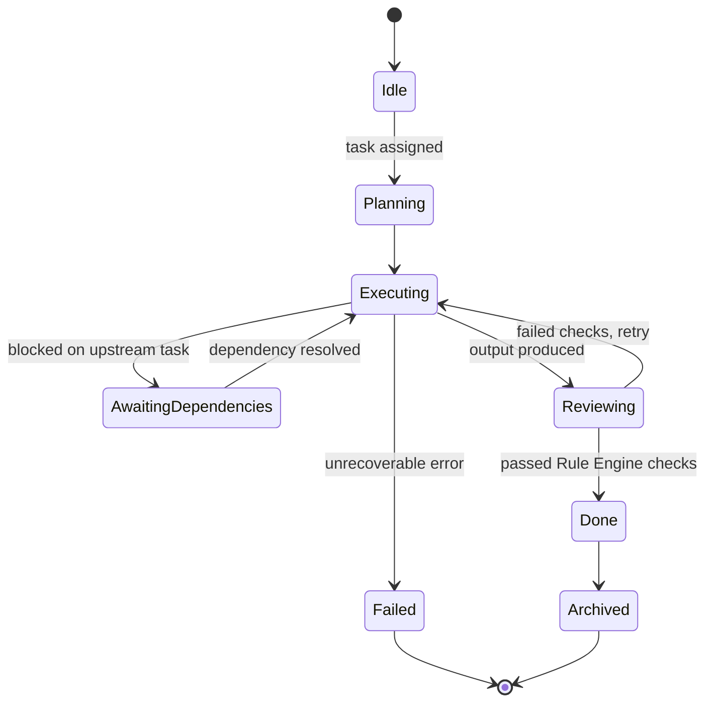
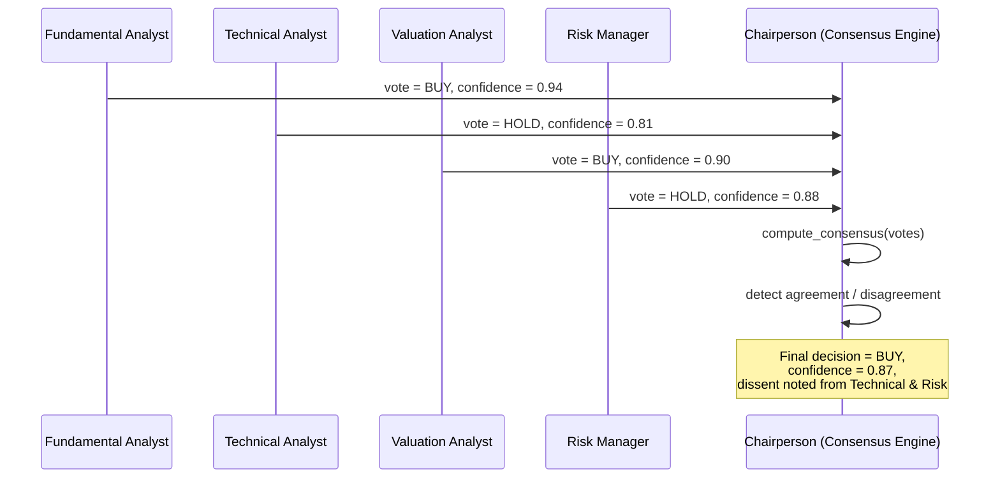
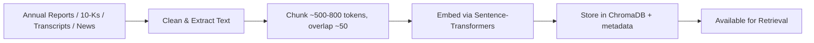
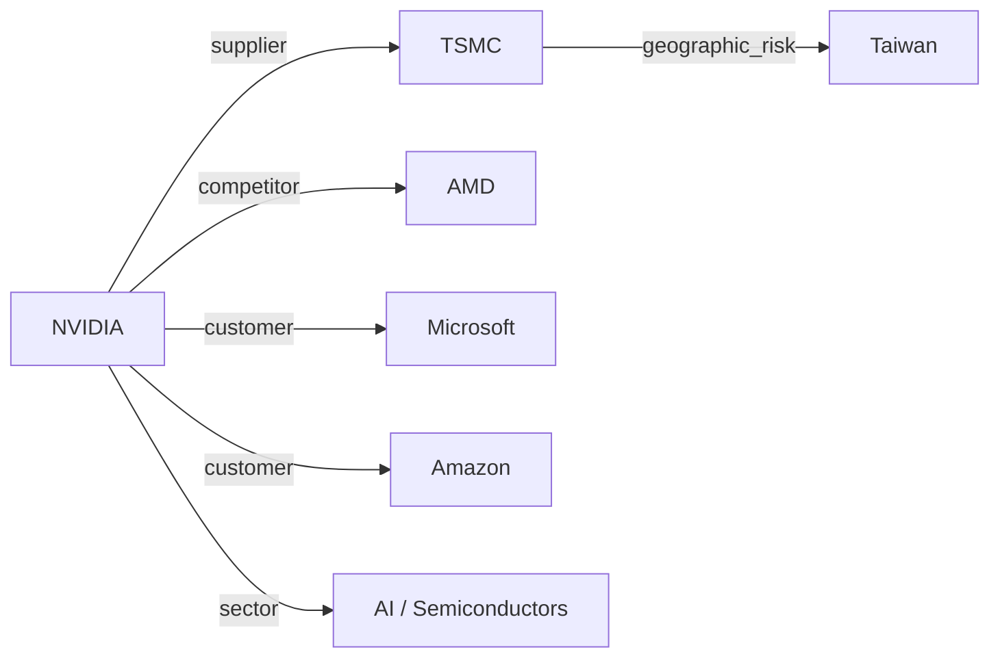
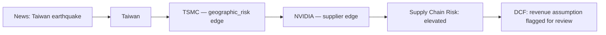

# InvestorGPT — Volume 3
## AI Agent Design & Intelligence Layer

**Covers:** Part 6 (AI Agent Design) · Part 7 (LLM Integration) · Part 8 (Memory System) · Part 9 (Knowledge Management — RAG/GraphRAG)
**Previous:** `InvestorGPT_02_Requirements_and_Architecture.md` · **Next:** `InvestorGPT_04_Backend_Frontend_Database_API.md`

---

# Part 6 — AI Agent Design

## 6.1 Agent Roster

**Table 3.1 — Complete Agent Roster**

| Agent | Purpose | Input | Output |
|---|---|---|---|
| **Company Resolver Agent** | Convert free text into a verified company identity | Raw user query | `Company{ticker, exchange, country, currency, sector}` |
| **Planner Agent** | Decompose a request into an executable task graph | Resolved company | `TaskGraph` (Volume 2, Part 5.7) |
| **Task Manager** | Execute the task graph respecting dependencies | `TaskGraph` | Completed task results |
| **Financial Agent** | Drive the Financial Engine | Verified financial statements | Ratios, growth, scores, flags |
| **Technical Agent** | Drive the Technical Engine | Verified OHLCV | Indicators, patterns, technical score |
| **Valuation Agent** | Drive the Valuation Engine | Financial Agent output | Fair value, scenarios, sensitivity |
| **News Agent** | Drive the News Intelligence Engine | Raw news feed | Categorized, deduplicated, scored news |
| **Sentiment Agent** | Drive the Sentiment Engine | Reddit/forum data | Bullish/bearish distribution + confidence |
| **Macro Agent** | Drive the Macroeconomic Engine | FRED/World Bank data | Macro factors + company exposure |
| **Risk Agent** | Drive the Risk Engine | All prior engine outputs | Categorized risk scores |
| **Competitor Agent** | Identify and compare peers | Sector/industry/market cap | Peer comparison table |
| **Portfolio Agent** | Analyze a user-uploaded portfolio | Holdings list | Diversification/exposure/risk metrics |
| **Consensus Engine ("Chairperson")** | Combine every engine's independent vote | All engine outputs | Weighted recommendation + confidence |
| **Reviewer Agent** | Final QA before publication | Draft recommendation | Approved report or revision request |
| **Report Agent** | Render dashboard/PDF/Excel/PPTX | Approved recommendation | Exportable artifacts |

> **Design note:** none of these agents perform arithmetic. Every agent that needs a number calls the **Core Calculation Engine** (Volume 5, Part 14) and receives a value plus its full provenance metadata. The agent's job is orchestration and explanation, never computation.

## 6.2 Agent Lifecycle

**Figure 3.1 — Generic Agent Lifecycle**



## 6.3 Planning & Task Decomposition

The Planner Agent never executes work — it only declares what work is needed and in what order, which the Task Manager then schedules.

```python
# backend/app/agents/planner.py
from dataclasses import dataclass, field

@dataclass
class AgentTask:
    name: str
    depends_on: list[str] = field(default_factory=list)

class PlannerAgent:
    """Builds the task graph for a single company analysis.
    Pure function: same company in -> same task graph out."""

    def plan(self, company) -> list[AgentTask]:
        return [
            AgentTask("market_data"),
            AgentTask("financial_statements"),
            AgentTask("news"),
            AgentTask("reddit_sentiment"),
            AgentTask("macro_data"),
            AgentTask("financial_analysis", depends_on=["financial_statements"]),
            AgentTask("technical_analysis", depends_on=["market_data"]),
            AgentTask("valuation", depends_on=["financial_analysis"]),
            AgentTask("risk_analysis", depends_on=[
                "financial_analysis", "news", "reddit_sentiment", "macro_data"
            ]),
            AgentTask("competitor_analysis", depends_on=["financial_analysis"]),
            AgentTask("consensus", depends_on=[
                "financial_analysis", "technical_analysis", "valuation", "risk_analysis"
            ]),
            AgentTask("review", depends_on=["consensus"]),
            AgentTask("report", depends_on=["review"]),
        ]
```

## 6.4 Reasoning & Decision Making

The Consensus Engine treats every upstream engine as an **independent analyst** that casts one vote with its own confidence score. Reasoning is therefore evidence aggregation, not free-form LLM judgment.

```python
# backend/app/engines/consensus_engine.py
from dataclasses import dataclass

@dataclass
class EngineVote:
    engine_name: str
    decision: str          # e.g. "BUY", "HOLD", "SELL"
    confidence: float       # 0.0 - 1.0
    weight: float           # configurable, sums to 1.0 across all engines

DECISION_RANK = {"STRONG_SELL": -3, "SELL": -2, "HOLD": 0, "BUY": 2, "STRONG_BUY": 3}

def compute_consensus(votes: list[EngineVote]) -> dict:
    weighted_score = sum(
        DECISION_RANK[v.decision] * v.confidence * v.weight for v in votes
    )
    total_weight = sum(v.weight for v in votes)
    normalized_score = weighted_score / total_weight if total_weight else 0.0

    if normalized_score >= 2.0:
        decision = "STRONG_BUY"
    elif normalized_score >= 0.5:
        decision = "BUY"
    elif normalized_score <= -2.0:
        decision = "STRONG_SELL"
    elif normalized_score <= -0.5:
        decision = "SELL"
    else:
        decision = "HOLD"

    agreement = 1 - (max(v.confidence for v in votes) - min(v.confidence for v in votes))
    return {
        "decision": decision,
        "score": normalized_score,
        "agreement": agreement,
        "votes": votes,
    }
```

## 6.5 Reflection & Self-Correction (Reviewer Agent)

The Reviewer Agent runs a deterministic checklist **before** any LLM-generated explanation is attached to the report:

**Table 3.2 — Reviewer Agent Checklist**

| Check | Failure Action |
|---|---|
| Every cited number traces to a stored source record | Reject — block report generation |
| No two engines contradict each other without an explanation | Flag for "mixed signal" framing in the report |
| Revenue ≥ Net Income, Assets ≥ 0, Shares Outstanding > 0, etc. | Reject — return to Financial Engine |
| DCF assumptions inside sane bounds (e.g., terminal growth < discount rate) | Reject — return to Valuation Engine |
| Every claim of the form "X grew by Y%" matches the underlying stored time series | Reject — return to originating engine |
| Confidence score is computed, not hardcoded | Reject if confidence field is missing or default |

```python
# backend/app/agents/reviewer.py
class ReviewerAgent:
    def review(self, draft: dict) -> dict:
        failures = []
        if not self._all_claims_cited(draft):
            failures.append("uncited_claim")
        if not self._math_is_consistent(draft):
            failures.append("math_inconsistency")
        if not self._dcf_assumptions_valid(draft):
            failures.append("invalid_dcf_assumptions")

        if failures:
            return {"status": "REJECTED", "reasons": failures}
        return {"status": "APPROVED", "report": draft}
```

## 6.6 Tool Usage & Tool Router

No agent calls an external tool directly. Every tool call passes through a **Tool Router**, which is what makes providers, models, and exporters replaceable (Volume 2, Part 5.6).

```python
# backend/app/agents/tool_router.py
class ToolRouter:
    def __init__(self, news_provider, market_provider, llm_provider):
        self.news_provider = news_provider
        self.market_provider = market_provider
        self.llm_provider = llm_provider

    async def fetch_news(self, ticker: str):
        return await self.news_provider.get_news(ticker)

    async def fetch_price(self, ticker: str):
        return await self.market_provider.get_price(ticker)

    async def explain(self, prompt: str) -> str:
        return await self.llm_provider.generate(prompt)
```

## 6.7 Multi-Agent Collaboration: The Investment Committee Pattern

**Figure 3.2 — Investment Committee Voting Sequence**



The Chairperson never overrides an individual analyst's vote — it documents disagreement explicitly in the final report (see Volume 1, Part 1.5, Principle 5).

## 6.8 State Management

Every analysis is a row in the `analyses` table (Volume 4, Part 12.2) carrying its current `AnalysisState` (Volume 1, Part 2.4). This allows:

- **Resumability** — a crashed worker doesn't lose progress; the next worker picks up from the last persisted state.
- **Auditability** — every state transition is timestamped and logged to the Observability layer (Volume 7, Part 21).
- **Cancellation** — a user-cancelled analysis simply transitions to `CANCELLED` and the Task Manager stops scheduling its remaining tasks.

---

# Part 7 — LLM Integration

## 7.1 Why Multiple Models

InvestorGPT deliberately avoids a "one model does everything" design. Computation (ratios, indicators, DCF) is **never** delegated to a language model. Language models are reserved for the tasks they are actually good at: summarizing, explaining, and writing.

**Table 3.3 — Task-to-Model Mapping**

| Task | Handled By |
|---|---|
| Any numeric calculation | Core Calculation Engine (pure Python) |
| Sentiment classification | FinBERT (domain-specific classifier) |
| Embeddings for retrieval | Sentence-Transformers / BGE |
| Narrative explanation, report writing, chat | General LLM (Qwen/Llama via Ollama) |
| Code-adjacent tasks (e.g., generating a plugin scaffold) | Code-specialized model (optional, e.g. DeepSeek-Coder) |

## 7.2 Model Router

```python
# backend/app/providers/llm_router.py
from abc import ABC, abstractmethod

class LLMProvider(ABC):
    @abstractmethod
    async def generate(self, prompt: str, **kwargs) -> str: ...

class OllamaProvider(LLMProvider):
    def __init__(self, model: str):
        self.model = model
    async def generate(self, prompt: str, **kwargs) -> str:
        # calls local Ollama daemon
        ...

class ModelRouter:
    """Routes each task type to the model best suited for it,
    with a documented fallback chain per task type."""

    def __init__(self, routes: dict[str, list[LLMProvider]]):
        self.routes = routes   # e.g. {"financial_explanation": [qwen, llama]}

    async def generate(self, task_type: str, prompt: str) -> str:
        for provider in self.routes.get(task_type, []):
            try:
                return await provider.generate(prompt)
            except Exception:
                continue
        raise RuntimeError(f"No available LLM provider for task '{task_type}'")
```

## 7.3 Prompt Engineering Principles

The single most important rule: **separate facts from opinions in every prompt.**

```text
SYSTEM:
You are the Financial Explanation Agent for InvestorGPT.
You will be given a JSON object of ALREADY-CALCULATED, ALREADY-VERIFIED
financial metrics. You must NEVER invent, adjust, or recompute any number.
Your only job is to explain what the numbers mean in plain English,
referencing the exact figures provided.

If a metric is missing from the input, say "data unavailable" — do not estimate it.

INPUT (facts, computed by Python, already verified):
{
  "revenue_growth_cagr_5y": 0.182,
  "roe": 0.341,
  "debt_to_equity": 0.41,
  "source": "FY2025 Annual Report, verified against SEC EDGAR"
}

TASK: Write a 2-3 sentence interpretation of financial health for a
beginner-level reader. Cite the revenue growth figure exactly as given.
```

This pattern — facts in, prose out, no numeric authority given to the model — is used for every explanation prompt in the system (financial summary, technical summary, risk narrative, bull/bear thesis). The full prompt library, with five additional worked examples, is in **Volume 8, Part 26**.

## 7.4 Prompt Manager & Versioning

```text
backend/app/prompts/
├── financial_explanation.md
├── technical_summary.md
├── valuation_narrative.md
├── risk_narrative.md
├── reviewer_checklist.md
├── consensus_discussion.md
└── chat_grounded_qa.md
```

Each prompt file carries front-matter metadata:

```yaml
---
name: financial_explanation
version: 3
author: platform-team
last_evaluation_score: 0.93
changelog:
  - v3: tightened "never invent numbers" instruction after evaluation regression
  - v2: added beginner/intermediate/CFA reading-level variants
  - v1: initial version
---
```

If a new prompt version scores worse on the Evaluation Framework (Volume 7, Part 21 / Volume 6, Part 19.4), it is rolled back automatically rather than deployed.

## 7.5 Context Window & Token Management

- Only the **verified, structured output** of the relevant engine is placed in context — never raw HTML, raw API responses, or unfiltered news text.
- Long documents (10-K filings, earnings transcripts) are chunked and retrieved via the RAG pipeline (Part 9) rather than stuffed into the prompt wholesale.
- A token budget is enforced per prompt type; if retrieved context would exceed the budget, the highest-ranked chunks are kept and the rest are dropped with a logged warning.

## 7.6 Embedding Models

Sentence-Transformers (or BGE) embeddings are used for:
- Semantic search over ingested filings, transcripts, and news (Part 9),
- Long-term Research Memory similarity search (Part 8),
- Duplicate news-story detection (near-duplicate embeddings merge into one event).

## 7.7 Fallback Strategy

If the primary local model is unavailable (e.g., Ollama daemon not running, model not pulled), the Model Router falls back to the next configured model for that task type. If no model is available, narrative explanation is replaced with a templated, fact-only summary rather than blocking the entire report.

## 7.8 Cost Controller

Even in the free, self-hosted configuration, the system tracks:

**Table 3.4 — Cost Controller Metrics**

| Metric | Purpose |
|---|---|
| Tokens generated per report | Capacity planning |
| Wall-clock generation time | Performance tuning |
| CPU/GPU utilization during generation | Hardware sizing guidance |
| API call counts per provider | Staying within free-tier rate limits |

This data feeds the Observability Dashboard (Volume 7, Part 21) and the Evaluation Framework.

---

# Part 8 — Memory System

## 8.1 Four Memory Layers

**Table 3.5 — Memory Layer Definitions**

| Layer | Scope | Example Contents | Storage |
|---|---|---|---|
| **Conversation Memory** | Current chat session only | "Compare NVIDIA and AMD" follow-up context | In-process / Redis (TTL) |
| **Research Memory** | Everything about one company, forever | Financial history, prior reports, news archive | PostgreSQL + ChromaDB |
| **Market Memory** | Sector/macro context shared across companies | Sector trends, macro indicator history | PostgreSQL |
| **System Memory** | Platform-level, not company-specific | Prompt templates, Rule Engine rules, plugin metadata, evaluation history | PostgreSQL + filesystem |

## 8.2 Short-Term vs Long-Term Memory

- **Short-term:** the current analysis session's intermediate results, held in memory/Redis only for the duration of the request, discarded after the report is generated (except for what is persisted to long-term storage).
- **Long-term:** every completed analysis is persisted indefinitely (unless the user deletes it), enabling the Decision Memory Engine (Part 8.6) and version history (Volume 1, FR-027).

## 8.3 Vector Storage (ChromaDB)

**Table 3.6 — ChromaDB Collections**

| Collection | Contents | Used By |
|---|---|---|
| `filings_chunks` | Chunked 10-K/10-Q/annual report text + embeddings | RAG retrieval (Part 9) |
| `news_chunks` | Deduplicated news article embeddings | News Engine, duplicate detection |
| `transcripts_chunks` | Earnings call transcript chunks | Earnings Engine |
| `company_notes` | AI-generated research notes per company | Research Memory, AI Chat |

## 8.4 Graph Memory

Relationship data (supplier, competitor, customer, sector membership, macro exposure) is **not** stored as embeddings — it is stored as structured entities and edges in the Knowledge Graph Engine (Part 9.5), because relationships need exact traversal, not similarity search.

## 8.5 Memory Lifecycle, Compression & Retention

| Policy | Rule |
|---|---|
| Retention | Long-term memory is never deleted automatically; only by explicit user action |
| Compression | Older raw news/transcript text is summarized and the summary retained; original text reference (URL/source) is kept, not duplicated indefinitely |
| Re-fetch trigger | A new filing, new quarter, or cache-expiry event triggers selective re-fetch (Volume 2, Part 4.1), not a full re-download |

## 8.6 Decision Memory Engine

**Figure 3.3 — Decision Memory / Re-Analysis Diff Flow**

```mermaid
flowchart LR
    A[New "Analyze NVIDIA" request] --> B{Prior completed<br/>analysis exists?}
    B -- No --> C[Run full pipeline]
    B -- Yes --> D[Load prior analysis snapshot]
    D --> E[Determine stale categories<br/>via cache freshness rules]
    E --> F[Re-fetch only stale categories]
    F --> G[Recompute affected engines]
    G --> H[Diff against prior snapshot]
    H --> I["What Changed Since [date]" panel]
```

This is what allows InvestorGPT to answer "how has my investment thesis on NVIDIA evolved since January?" — every change is a structured diff, not a freshly written paragraph with no memory of the past.

---

# Part 9 — Knowledge Management (RAG / GraphRAG)

## 9.1 Document Ingestion Pipeline

**Figure 3.4 — Document Ingestion Pipeline**



## 9.2 Chunking Strategy

- Filings are chunked by logical section (e.g., "Risk Factors," "MD&A," "Financial Statements") where structure is detectable, falling back to fixed-size sliding-window chunks otherwise.
- Every chunk retains metadata: `source_document`, `company`, `fiscal_period`, `page_or_section`, `retrieved_at`.

## 9.3 Embedding & Indexing

- Embeddings are generated once per chunk and cached; re-ingestion of an unchanged document is a no-op (hash comparison against the previously ingested version).

## 9.4 Retrieval & Ranking

Hybrid search combines:
1. **Keyword/BM25 match** (good for exact terms: "Blackwell," "HBM3e," a specific dollar figure),
2. **Vector similarity** (good for conceptual queries: "what did management say about AI demand?").

Top results from both are merged and re-ranked before being placed in the LLM's context window (Part 7.5).

## 9.5 Knowledge Graph Engine

**Figure 3.5 — Knowledge Graph Excerpt (NVIDIA Ecosystem)**



Entities (companies, sectors, countries, commodities) and typed edges (supplier, competitor, customer, geographic exposure) are stored in a graph-capable structure so multi-hop reasoning is possible.

## 9.6 GraphRAG Reasoning Example

A news event ingested as plain text ("Taiwan earthquake disrupts semiconductor manufacturing") is enriched by graph traversal before it reaches the Risk Engine:

**Figure 3.6 — GraphRAG Multi-Hop Reasoning Example**



This is what allows the Risk Engine to say *why* an event matters for a specific company instead of stopping at "TSMC affected."

## 9.7 Knowledge Update & Freshness Policy

The Knowledge Graph is updated incrementally as new filings, news, and transcripts are ingested. Edges are versioned (e.g., "competitor as of FY2025") so historical analyses remain reproducible even as relationships evolve (e.g., a company switching suppliers).

## 9.8 Research Provenance Engine

Every AI-generated claim must be traceable through the full chain:

```text
Claim: "Revenue growth is accelerating."
   └── Derived from: Growth Engine (Volume 5, Part 14.4)
         └── Inputs: FY2023, FY2024, FY2025 revenue (Financial Engine)
               └── Source: 2025 Annual Report, p.41 (Verification Engine, confidence 99%)
   └── Explained by: Financial Explanation Agent (Part 7.3)
```

This chain is what populates the "Evidence Panel" referenced in the original product design and is stored alongside every report for audit purposes (Volume 6, Part 17.6 — Disaster Recovery & Audit).

> **Continue to Volume 4** — `InvestorGPT_04_Backend_Frontend_Database_API.md` — for backend structure, frontend architecture, database schema, and the full API reference.
