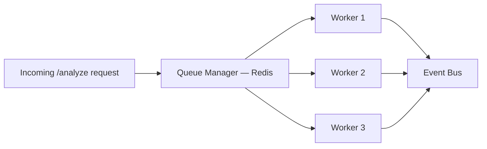
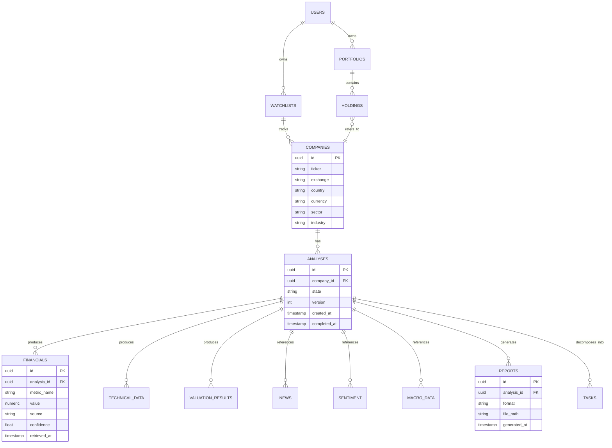

# InvestorGPT — Volume 4
## Backend, Frontend, Database & API

**Covers:** Part 10 (Backend) · Part 11 (Frontend — Expanded) · Part 12 (Database) · Part 13 (API)
**Previous:** `InvestorGPT_03_AI_Agent_and_Intelligence_Layer.md` · **Next:** `InvestorGPT_05_Algorithms_Implementation_Security.md`

---

# Part 10 — Backend Architecture

## 10.1 Service Map

The backend is a FastAPI application organized into five sub-layers: `api` (HTTP boundary), `agents` (orchestration), `engines` (analysis logic), `providers` (external I/O), and `services` (cross-cutting business logic that coordinates engines and providers).

## 10.2 Folder Structure

```text
InvestorGPT/
├── README.md
├── LICENSE
├── .env.example
├── docker-compose.yml
├── requirements.txt
├── pyproject.toml
│
├── backend/
│   └── app/
│       ├── main.py                  # FastAPI app entrypoint
│       ├── config.py                # Pydantic settings loader
│       ├── settings.py              # Environment-driven configuration
│       ├── dependencies.py          # FastAPI dependency-injection wiring
│       │
│       ├── api/
│       │   ├── routes_analyze.py
│       │   ├── routes_company.py
│       │   ├── routes_report.py
│       │   ├── routes_compare.py
│       │   ├── routes_portfolio.py
│       │   └── routes_chat.py
│       │
│       ├── agents/
│       │   ├── company_resolver.py
│       │   ├── planner.py
│       │   ├── task_manager.py
│       │   ├── consensus.py
│       │   ├── reviewer.py
│       │   ├── tool_router.py
│       │   └── report_agent.py
│       │
│       ├── orchestration/
│       │   ├── workflow_orchestrator.py
│       │   ├── event_bus.py
│       │   ├── state_machine.py
│       │   ├── queue_manager.py
│       │   └── worker_pool.py
│       │
│       ├── engines/
│       │   ├── financial/
│       │   │   ├── ratio_engine.py
│       │   │   ├── growth_engine.py
│       │   │   ├── quality_score_engine.py
│       │   │   └── red_flag_engine.py
│       │   ├── technical/
│       │   │   ├── trend_engine.py
│       │   │   ├── indicator_engine.py
│       │   │   ├── pattern_engine.py
│       │   │   ├── smc_engine.py
│       │   │   └── multi_timeframe_engine.py
│       │   ├── valuation/
│       │   │   ├── dcf_engine.py
│       │   │   ├── comparables_engine.py
│       │   │   └── consensus_valuation.py
│       │   ├── news_engine.py
│       │   ├── sentiment_engine.py
│       │   ├── macro_engine.py
│       │   ├── risk_engine.py
│       │   ├── competitor_engine.py
│       │   ├── portfolio_engine.py
│       │   ├── knowledge_graph_engine.py
│       │   ├── verification_engine.py
│       │   ├── rule_engine.py
│       │   └── calculation_engine.py     # shared formula/statistics core
│       │
│       ├── providers/
│       │   ├── base.py
│       │   ├── market/
│       │   │   ├── yahoo_provider.py
│       │   │   ├── stooq_provider.py
│       │   │   └── alphavantage_provider.py
│       │   ├── filings/
│       │   │   └── sec_edgar_provider.py
│       │   ├── news/
│       │   │   ├── google_news_provider.py
│       │   │   └── newsapi_provider.py
│       │   ├── social/
│       │   │   └── reddit_provider.py
│       │   ├── macro/
│       │   │   ├── fred_provider.py
│       │   │   └── worldbank_provider.py
│       │   └── llm/
│       │       ├── ollama_provider.py
│       │       └── llm_router.py
│       │
│       ├── services/
│       │   ├── company_service.py
│       │   ├── analysis_service.py
│       │   ├── report_service.py
│       │   ├── chart_service.py
│       │   └── comparison_service.py
│       │
│       ├── models/                  # SQLAlchemy ORM models
│       ├── schemas/                 # Pydantic request/response schemas
│       ├── repositories/            # DB access layer (one per table family)
│       ├── cache/                   # Redis cache client + TTL policy
│       ├── database/                # session, migrations (Alembic)
│       ├── reports/                 # PDF/Excel/PPTX renderers
│       ├── prompts/                 # versioned prompt templates (Vol 3, Part 7.4)
│       ├── plugins/                 # Plugin SDK + built-in plugins
│       ├── utils/
│       └── tests/
│
├── frontend/                        # Next.js application (Part 11)
├── docker/                          # Dockerfiles per service
├── docs/                            # This documentation suite
└── scripts/                         # one-off ops/dev scripts
```

## 10.3 Providers Layer — Worked Example

```python
# backend/app/providers/market/yahoo_provider.py
from datetime import datetime, timezone
from app.providers.base import MarketDataProvider

class YahooProvider(MarketDataProvider):
    SOURCE_NAME = "yahoo_finance"
    TRUST_SCORE = 96

    async def get_price(self, ticker: str) -> dict:
        raw = await self._fetch(ticker)   # network call wrapped with timeout/retry
        return {
            "price": float(raw["regularMarketPrice"]),
            "currency": raw["currency"],
            "as_of": datetime.now(timezone.utc),
            "source": self.SOURCE_NAME,
            "trust_score": self.TRUST_SCORE,
        }

    async def get_financial_statements(self, ticker: str, years: int = 10) -> dict:
        ...
```

Every provider exposes the **same shape** of return value (`price`, `currency`, `as_of`, `source`, `trust_score`) so the Verification Engine (Volume 5) can compare across providers without provider-specific logic.

## 10.4 Services Layer

Services coordinate engines + providers and expose a clean call surface to the API layer. For example, `analysis_service.py` is the single function the `/api/v1/analyze` route calls — it never talks to providers or the database directly, only through repositories and engines.

## 10.5 Caching Strategy

**Table 4.1 — Cache Key / TTL Reference**

| Cache Key Pattern | TTL | Backing Store |
|---|---|---|
| `price:{ticker}` | 60s (intraday) | Redis |
| `profile:{ticker}` | 30 days | Redis + Postgres |
| `financials:{ticker}:{period}` | until new filing detected | Postgres (source of truth) + Redis (hot cache) |
| `news:{ticker}` | 10 min | Redis |
| `fx:{pair}` | 1 day | Redis |
| `macro:{indicator}` | 1 day | Redis |

## 10.6 Queue & Worker Architecture

**Figure 4.1 — Queue & Worker Topology**



Workers are stateless and horizontally scalable — adding a fourth worker requires only a configuration/`docker-compose` change, never a code change.

## 10.7 File & Report Storage

Generated PDFs, Excel workbooks, and PPTX files are written to a content-addressed storage path (`reports/{analysis_id}/{format}`) and referenced by URL from the `reports` table (Part 12.2).

## 10.8 Authentication & Authorization (Summary)

JWT-based session auth for the hosted/multi-user mode; API-key auth for programmatic/API access. Full threat model and implementation detail is in **Volume 5, Part 16.2**.

---

# Part 11 — Frontend Architecture

## 11.1 Design System Principles

- **Data first** — every screen leads with the answer, not a loading spinner.
- **Summary → detail** — headline metrics are always visible before the user has to click into a chart or table.
- **Every number is clickable** — clicking any metric opens its Evidence Panel (formula, calculation, source, confidence).
- Dark mode and light mode both fully supported from day one.
- **Progressive disclosure** — a beginner never sees a wall of indicators; everything advanced is one click deeper, never deleted.

**Table 4.2 — Design Token Reference (excerpt)**

| Token | Light Mode | Dark Mode | Used For |
|---|---|---|---|
| `--ig-color-bullish` | `#0E8A4B` | `#34D399` | Positive metrics, BUY badges |
| `--ig-color-bearish` | `#C23B3B` | `#F87171` | Negative metrics, SELL badges |
| `--ig-color-neutral` | `#6B7280` | `#9CA3AF` | HOLD badges, secondary text |
| `--ig-color-surface` | `#FFFFFF` | `#0F1115` | Card backgrounds |
| `--ig-radius-card` | `12px` | `12px` | All card components |
| `--ig-font-mono` | `"IBM Plex Mono"` | `"IBM Plex Mono"` | Tickers, numeric values |

## 11.2 Page / Component Hierarchy

```text
frontend/
├── app/
│   ├── (dashboard)/
│   │   ├── page.tsx                 # Home / search
│   │   ├── company/[ticker]/
│   │   │   ├── page.tsx             # Investment Dashboard
│   │   │   ├── financials/page.tsx
│   │   │   ├── technical/page.tsx
│   │   │   ├── valuation/page.tsx
│   │   │   ├── news/page.tsx
│   │   │   ├── risk/page.tsx
│   │   │   └── chat/page.tsx
│   │   ├── compare/page.tsx
│   │   └── portfolio/page.tsx
│   └── layout.tsx
├── components/
│   ├── charts/ (CandlestickChart, RevenueChart, SensitivityHeatmap, ...)
│   ├── cards/ (InvestmentScoreCard, RecommendationCard, ConfidenceMeter, ...)
│   ├── evidence/ (EvidencePanel, SourceBadge, CitationTooltip)
│   └── navigation/ (CompanySearch, ReportSidebar)
└── lib/
    ├── api-client.ts
    └── types.ts
```

## 11.3 Navigation Model

A persistent sidebar (Volume 1, Part 2 "Report Navigation") lets the user jump directly to any section (Executive Summary → Financial → Technical → Valuation → News → Risk → Recommendation → Appendix) without scrolling through a single long document.

**Figure 4.2 — Frontend Navigation & Data-Fetch Flow**

```mermaid
flowchart TD
    SEARCH[CompanySearch] --> RESULT[Resolved Company]
    RESULT --> DASH[Investment Dashboard /company/ticker]
    DASH --> SIDEBAR[ReportSidebar]
    SIDEBAR --> FIN_PAGE[/financials]
    SIDEBAR --> TECH_PAGE[/technical]
    SIDEBAR --> VAL_PAGE[/valuation]
    SIDEBAR --> NEWS_PAGE[/news]
    SIDEBAR --> RISK_PAGE[/risk]
    SIDEBAR --> CHAT_PAGE[/chat]
    FIN_PAGE --> EVIDENCE[EvidencePanel on click]
    TECH_PAGE --> EVIDENCE
    VAL_PAGE --> EVIDENCE
```

## 11.4 State Management & Data Fetching

Server data is fetched through a single typed API client (`lib/api-client.ts`). Query results are cached client-side (React Query–style: stale-while-revalidate) keyed by `analysis_id`, so navigating between Financials → Technical → Valuation tabs for the same company never re-fetches data that is already in memory. Local UI state (selected timeframe, indicator toggles, theme) lives in component state or a lightweight global store — it is never mixed with server data state.

```typescript
// frontend/lib/api-client.ts
export interface AnalyzeResponse {
  analysisId: string;
  state: AnalysisState;
  recommendation?: Recommendation;
  engineVotes?: EngineVote[];
}

export interface Recommendation {
  decision: "STRONG_BUY" | "BUY" | "HOLD" | "SELL" | "STRONG_SELL";
  confidence: number;
  investmentScore: number;
  fairValue: number;
  currentPrice: number;
  marginOfSafety: number;
}

export async function analyzeCompany(query: string): Promise<AnalyzeResponse> {
  const res = await fetch("/api/v1/analyze", {
    method: "POST",
    headers: { "Content-Type": "application/json" },
    body: JSON.stringify({ query, depth: "standard" }),
  });
  if (!res.ok) {
    const err = await res.json();
    throw new ApiError(err.error.code, err.error.message);
  }
  return res.json();
}
```

## 11.5 Worked Component Example — `InvestmentScoreCard`

This is the single most important component in the product: it is the first thing a user sees, and every number on it must be clickable into its Evidence Panel (Volume 3, Part 9.8).

```tsx
// frontend/components/cards/InvestmentScoreCard.tsx
import { useState } from "react";
import { Recommendation } from "@/lib/types";
import { EvidencePanel } from "@/components/evidence/EvidencePanel";

interface Props {
  recommendation: Recommendation;
  analysisId: string;
}

const DECISION_LABEL: Record<Recommendation["decision"], string> = {
  STRONG_BUY: "Strong Buy",
  BUY: "Buy",
  HOLD: "Hold",
  SELL: "Sell",
  STRONG_SELL: "Strong Sell",
};

export function InvestmentScoreCard({ recommendation, analysisId }: Props) {
  const [evidenceMetric, setEvidenceMetric] = useState<string | null>(null);
  const upsidePct =
    ((recommendation.fairValue - recommendation.currentPrice) /
      recommendation.currentPrice) *
    100;

  return (
    <div className="ig-card" data-testid="investment-score-card">
      <div className="ig-card__header">
        <span className={`ig-badge ig-badge--${recommendation.decision.toLowerCase()}`}>
          {DECISION_LABEL[recommendation.decision]}
        </span>
        <span className="ig-confidence-meter" title="Confidence (see Evidence Panel)">
          {Math.round(recommendation.confidence * 100)}% confidence
        </span>
      </div>

      <button
        className="ig-metric ig-metric--clickable"
        onClick={() => setEvidenceMetric("investment_score")}
      >
        <span className="ig-metric__label">Investment Score</span>
        <span className="ig-metric__value">{recommendation.investmentScore}/100</span>
      </button>

      <button
        className="ig-metric ig-metric--clickable"
        onClick={() => setEvidenceMetric("fair_value")}
      >
        <span className="ig-metric__label">Fair Value vs. Current Price</span>
        <span className="ig-metric__value">
          ${recommendation.fairValue.toFixed(2)} vs ${recommendation.currentPrice.toFixed(2)}{" "}
          ({upsidePct >= 0 ? "+" : ""}{upsidePct.toFixed(1)}%)
        </span>
      </button>

      {evidenceMetric && (
        <EvidencePanel
          analysisId={analysisId}
          metricKey={evidenceMetric}
          onClose={() => setEvidenceMetric(null)}
        />
      )}
    </div>
  );
}
```

## 11.6 Accessibility & Responsive Design

- Full keyboard navigation across dashboard and charts (tab order follows visual hierarchy: badge → score → fair value → evidence trigger).
- WCAG 2.1 AA color contrast for both themes; the design tokens in Table 4.2 are pre-validated against AA contrast ratios.
- Colorblind-safe encodings for bull/bear and risk-heatmap visualizations — color is always paired with a shape/icon or text label, never used as the sole signal.
- Responsive breakpoints: a single-column card stack on mobile, a two-column dashboard on tablet, and the full multi-panel layout (sidebar + main + evidence drawer) on desktop.
- All interactive charts expose an accessible data-table fallback (`<table>` with `aria-label`) for screen-reader users, toggled via a "View as table" control.

## 11.7 Performance Optimization

- Charts are lazy-loaded (`next/dynamic`) so the initial dashboard paint never waits on a charting library bundle.
- The Evidence Panel's data is pre-fetched in the background once the parent metric is rendered (hover-intent prefetch), so the click-to-open feels instant.
- Server-rendered shell + client-hydrated interactive widgets (App Router server components for static layout, client components only for charts/evidence/chat).
- Images (company logos) are served through a CDN-friendly `next/image` pipeline with explicit width/height to avoid layout shift.

## 11.8 Key Component Reference

**Table 4.3 — Key Frontend Components**

| Component | Purpose |
|---|---|
| `InvestmentScoreCard` | Headline score, recommendation, confidence (full code in 11.5) |
| `EvidencePanel` | Expands any metric into formula → calculation → source → confidence |
| `CandlestickChart` | OHLCV + overlay of MAs/Bollinger/Fibonacci/S&R |
| `SensitivityHeatmap` | DCF growth-rate × discount-rate grid |
| `ConsensusBreakdown` | Per-engine vote, confidence, and weight (Volume 3, Part 6.4) |
| `ProgressTimeline` | Live analysis progress (Resolving → Fetching → Verifying → ... → Done) |
| `ComparisonTable` | Side-by-side metrics across selected companies |
| `RiskHeatmap` | Category × severity grid with pattern-based (not color-only) encoding |

---

# Part 12 — Database Design

## 12.1 Entity-Relationship Diagram

**Figure 4.3 — Core Entity-Relationship Diagram**



## 12.2 Core Table Schemas (PostgreSQL DDL)

```sql
CREATE TABLE companies (
    id              UUID PRIMARY KEY DEFAULT gen_random_uuid(),
    ticker          VARCHAR(20) NOT NULL,
    exchange        VARCHAR(50) NOT NULL,
    country         VARCHAR(60) NOT NULL,
    currency        VARCHAR(10) NOT NULL,
    sector          VARCHAR(100),
    industry        VARCHAR(100),
    name            VARCHAR(255) NOT NULL,
    created_at      TIMESTAMPTZ NOT NULL DEFAULT now(),
    UNIQUE (ticker, exchange)
);

CREATE TABLE analyses (
    id              UUID PRIMARY KEY DEFAULT gen_random_uuid(),
    company_id      UUID NOT NULL REFERENCES companies(id),
    state           VARCHAR(40) NOT NULL DEFAULT 'CREATED',
    version         INT NOT NULL DEFAULT 1,
    recommendation  VARCHAR(20),
    confidence      NUMERIC(5,4),
    created_at      TIMESTAMPTZ NOT NULL DEFAULT now(),
    completed_at    TIMESTAMPTZ,
    INDEX idx_analyses_company (company_id)
);

CREATE TABLE financials (
    id              UUID PRIMARY KEY DEFAULT gen_random_uuid(),
    analysis_id     UUID NOT NULL REFERENCES analyses(id),
    metric_name     VARCHAR(100) NOT NULL,
    value           NUMERIC,
    unit            VARCHAR(20),
    fiscal_period   VARCHAR(20),
    source          VARCHAR(100) NOT NULL,
    confidence      NUMERIC(5,4) NOT NULL,
    retrieved_at    TIMESTAMPTZ NOT NULL,
    UNIQUE (analysis_id, metric_name, fiscal_period)
);

CREATE TABLE technical_data (
    id              UUID PRIMARY KEY DEFAULT gen_random_uuid(),
    analysis_id     UUID NOT NULL REFERENCES analyses(id),
    timeframe       VARCHAR(10) NOT NULL,
    indicator_name  VARCHAR(50) NOT NULL,
    value           NUMERIC,
    computed_at     TIMESTAMPTZ NOT NULL
);

CREATE TABLE valuation_results (
    id              UUID PRIMARY KEY DEFAULT gen_random_uuid(),
    analysis_id     UUID NOT NULL REFERENCES analyses(id),
    model_name      VARCHAR(50) NOT NULL,      -- 'DCF', 'PEG', 'EV_EBITDA', ...
    fair_value      NUMERIC,
    assumptions     JSONB NOT NULL,
    confidence      NUMERIC(5,4) NOT NULL
);

CREATE TABLE reports (
    id              UUID PRIMARY KEY DEFAULT gen_random_uuid(),
    analysis_id     UUID NOT NULL REFERENCES analyses(id),
    format          VARCHAR(10) NOT NULL,       -- 'pdf' | 'xlsx' | 'pptx' | 'json'
    file_path       VARCHAR(500) NOT NULL,
    generated_at    TIMESTAMPTZ NOT NULL DEFAULT now()
);

CREATE TABLE tasks (
    id              UUID PRIMARY KEY DEFAULT gen_random_uuid(),
    analysis_id     UUID NOT NULL REFERENCES analyses(id),
    task_name       VARCHAR(50) NOT NULL,
    status          VARCHAR(20) NOT NULL DEFAULT 'PENDING',
    retries         INT NOT NULL DEFAULT 0,
    started_at      TIMESTAMPTZ,
    finished_at     TIMESTAMPTZ
);
```

## 12.3 Indexing Strategy

- Composite index on `(ticker, exchange)` for company lookups.
- Index on `analyses(company_id, created_at DESC)` to fetch "most recent analysis" quickly.
- Partial index on `tasks(status)` for `PENDING`/`RUNNING` rows to keep the Task Manager's polling cheap at scale.

## 12.4 Scaling Strategy

**Table 4.4 — Database Scaling Stages**

| Stage | Database Setup |
|---|---|
| Local / single-user | SQLite, single file, zero ops overhead |
| Small multi-user | PostgreSQL single instance + Redis |
| Production multi-tenant | PostgreSQL with read replicas, `analyses`/`financials` partitioned by month, Redis cluster for cache/queue |

---

# Part 13 — API Documentation

## 13.1 API Design Principles

- Versioned base path: `/api/v1/...`
- JSON in, JSON out; large binary exports (PDF/XLSX/PPTX) are returned as signed download URLs, not inline bytes.
- Every response includes a `meta` block with `request_id`, `generated_at`, and `data_confidence` where applicable.

## 13.2 Endpoint Reference

**Table 4.5 — REST API Endpoint Reference**

| Method | Path | Purpose | Auth |
|---|---|---|---|
| `POST` | `/api/v1/analyze` | Start (or fetch cached) analysis for a company | API key |
| `GET` | `/api/v1/analyze/{analysis_id}` | Poll analysis status / fetch result | API key |
| `POST` | `/api/v1/compare` | Multi-company comparison | API key |
| `GET` | `/api/v1/company/{ticker}` | Resolved company profile | API key |
| `GET` | `/api/v1/company/{ticker}/financials` | Structured financial statements | API key |
| `GET` | `/api/v1/company/{ticker}/technical` | Structured technical analysis | API key |
| `GET` | `/api/v1/company/{ticker}/valuation` | Structured valuation output | API key |
| `GET` | `/api/v1/company/{ticker}/risk` | Structured risk assessment | API key |
| `GET` | `/api/v1/company/{ticker}/news` | Categorized, deduplicated news | API key |
| `POST` | `/api/v1/report/{analysis_id}/export` | Trigger PDF/XLSX/PPTX export job | API key |
| `GET` | `/api/v1/history/{ticker}` | Version history of past analyses | API key |
| `POST` | `/api/v1/portfolio/analyze` | Upload and analyze a portfolio | API key |
| `POST` | `/api/v1/chat/{analysis_id}` | Ask a question grounded in one report | API key |

## 13.3 Example Request / Response

**Request**

```http
POST /api/v1/analyze
Content-Type: application/json
Authorization: Bearer <api_key>

{
  "query": "Analyze NVIDIA",
  "depth": "standard"
}
```

**Response (202 — analysis accepted, processing)**

```json
{
  "meta": {
    "request_id": "a1b2c3d4",
    "generated_at": "2026-06-26T10:15:02Z"
  },
  "analysis_id": "f47ac10b-58cc-4372-a567-0e02b2c3d479",
  "state": "FETCHING_DATA",
  "company": {
    "ticker": "NVDA",
    "exchange": "NASDAQ",
    "country": "USA",
    "currency": "USD"
  },
  "poll_url": "/api/v1/analyze/f47ac10b-58cc-4372-a567-0e02b2c3d479"
}
```

**Response (200 — analysis complete, abbreviated)**

```json
{
  "meta": { "request_id": "a1b2c3d4", "generated_at": "2026-06-26T10:15:34Z" },
  "analysis_id": "f47ac10b-58cc-4372-a567-0e02b2c3d479",
  "state": "COMPLETED",
  "recommendation": {
    "decision": "BUY",
    "confidence": 0.94,
    "investment_score": 91,
    "fair_value": 198.00,
    "current_price": 174.00,
    "margin_of_safety": 0.138
  },
  "engine_votes": [
    { "engine": "fundamental", "decision": "BUY", "confidence": 0.94, "weight": 0.25 },
    { "engine": "technical", "decision": "HOLD", "confidence": 0.81, "weight": 0.15 },
    { "engine": "valuation", "decision": "BUY", "confidence": 0.90, "weight": 0.20 },
    { "engine": "risk", "decision": "HOLD", "confidence": 0.88, "weight": 0.15 }
  ],
  "exports": {
    "pdf": null,
    "xlsx": null,
    "pptx": null
  }
}
```

## 13.4 Error Format & Codes

```json
{
  "meta": { "request_id": "a1b2c3d4" },
  "error": {
    "code": "COMPANY_NOT_FOUND",
    "message": "Could not resolve 'Asdfgh Corp' to a known listed company.",
    "suggestions": ["Did you mean: ..."]
  }
}
```

**Table 4.6 — Error Code Reference**

| HTTP Status | Code | Meaning |
|---|---|---|
| 404 | `COMPANY_NOT_FOUND` | No provider could resolve the input |
| 422 | `INVALID_REQUEST` | Malformed request body |
| 424 | `PROVIDER_UNAVAILABLE` | All providers in the fallback chain failed |
| 409 | `ANALYSIS_IN_PROGRESS` | A non-cached re-analysis was requested while one is already running |
| 503 | `INSUFFICIENT_DATA` | Not enough verified data to support a recommendation |

## 13.5 Rate Limiting

API-key-scoped rate limits (configurable; default suggestion: 60 requests/minute, 1000/day for the free local deployment) are enforced at the API gateway layer and reported via standard `X-RateLimit-*` response headers.

## 13.6 Future API Surface: GraphQL (Optional)

For consumers that want to request exactly the fields they need across multiple resources in one round trip (e.g., a mobile client fetching only `recommendation` + `fairValue` without the full financials payload), a GraphQL layer can be added **alongside** — not instead of — the REST API, without touching any engine code, since both would call the same `services/` layer (Part 10.4).

```graphql
# schema.graphql (illustrative, optional future addition)
type Recommendation {
  decision: String!
  confidence: Float!
  investmentScore: Int!
  fairValue: Float!
  currentPrice: Float!
}

type Query {
  analysis(id: ID!): Analysis
  company(ticker: String!): Company
}

type Analysis {
  id: ID!
  state: String!
  recommendation: Recommendation
}
```

> **Continue to Volume 5** — `InvestorGPT_05_Algorithms_Implementation_Security.md` — for every formula, the full repository conventions, and the security model.
