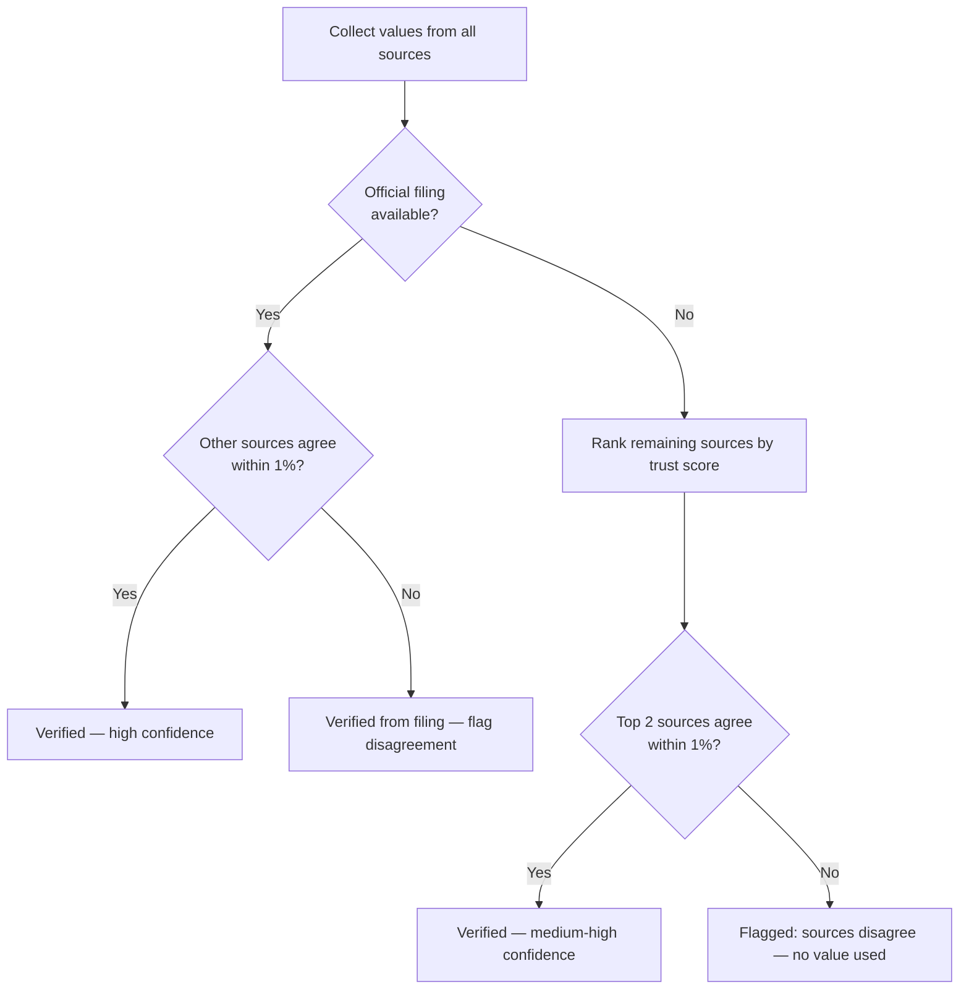
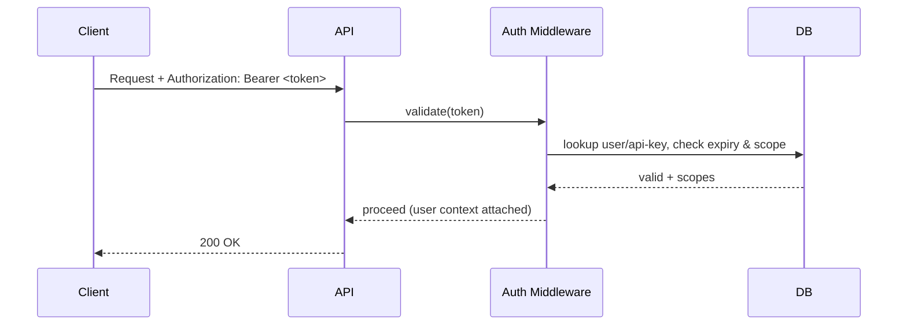

# InvestorGPT — Volume 5
## Algorithms, Implementation & Security

**Covers:** Part 14 (Algorithms) · Part 15 (Implementation Details) · Part 16 (Security)
**Previous:** `InvestorGPT_04_Backend_Frontend_Database_API.md` · **Next:** `InvestorGPT_06_Infrastructure_Performance_Testing_Deployment.md`

---

# Part 14 — Algorithms

> Every algorithm below lives in exactly one place in the codebase — the **Core Calculation Engine** (`backend/app/engines/calculation_engine.py`) or a dedicated sub-engine that calls into it. No language model ever performs this arithmetic.

## 14.1 Data Verification & Cross-Source Reconciliation

**Figure 5.1 — Verification Decision Flow**



```text
function verify_metric(metric_name, values_by_source, trust_scores):
    if len(values_by_source) == 0:
        return Unavailable(reason="no source returned a value")

    official = values_by_source.get("official_filing")
    if official is not None:
        agreeing = [v for v in values_by_source.values() if within_tolerance(v, official, pct=1%)]
        confidence = 0.9 + 0.1 * (len(agreeing) / len(values_by_source))
        return Verified(value=official, confidence=confidence, source="official_filing")

    # No official filing available — use highest-trust source, but only
    # if at least one other source agrees within tolerance.
    ranked = sort_by_trust_score(values_by_source, trust_scores)
    best = ranked[0]
    agreeing = [v for v in ranked[1:] if within_tolerance(v, best, pct=1%)]
    if agreeing:
        confidence = 0.7 + 0.25 * (len(agreeing) / (len(ranked) - 1))
        return Verified(value=best, confidence=confidence, source=ranked[0].source)

    return Flagged(reason="sources disagree beyond tolerance", candidates=values_by_source)
```

Trust score table (Volume 2 references this; canonical definition lives here):

**Table 5.1 — Source Trust Score Reference**

| Source Type | Trust Score |
|---|---|
| Official company filing (10-K/10-Q/Annual Report) | 100 |
| Regulator (SEC EDGAR, equivalent) | 99 |
| Stock exchange filing | 99 |
| Official Investor Relations page | 98 |
| Yahoo Finance | 96 |
| Alpha Vantage | 94 |
| Stooq | 93 |
| Community / aggregator APIs | 70 |

## 14.2 Outlier Detection

```python
def detect_outliers(values: list[float], z_threshold: float = 2.5) -> list[int]:
    """Returns indices of values that are statistical outliers relative
    to the group, so they can be excluded before averaging/consensus."""
    import statistics
    mean = statistics.mean(values)
    stdev = statistics.pstdev(values) or 1e-9
    return [i for i, v in enumerate(values) if abs((v - mean) / stdev) > z_threshold]
```

Outliers are **never averaged in** — they are excluded and logged, consistent with Volume 1, Principle 1 ("never hallucinate" — including never silently smoothing over a clearly wrong number).

## 14.3 Financial Ratio Library

**Table 5.2 — Core Financial Ratio Formulas**

| Ratio | Formula |
|---|---|
| Current Ratio | `current_assets / current_liabilities` |
| Quick Ratio | `(current_assets - inventory) / current_liabilities` |
| ROE | `net_income / shareholder_equity` |
| ROA | `net_income / total_assets` |
| ROIC | `nopat / invested_capital` |
| Debt/Equity | `total_debt / shareholder_equity` |
| Interest Coverage | `ebit / interest_expense` |
| Gross Margin | `(revenue - cogs) / revenue` |
| Operating Margin | `operating_income / revenue` |
| Net Margin | `net_income / revenue` |
| P/E | `price / eps` |
| PEG | `pe_ratio / eps_growth_rate_pct` |
| EV/EBITDA | `enterprise_value / ebitda` |
| Asset Turnover | `revenue / total_assets` |

```python
def current_ratio(current_assets: float, current_liabilities: float) -> float:
    if current_liabilities == 0:
        raise ValueError("current_liabilities cannot be zero")
    return current_assets / current_liabilities

def roe(net_income: float, shareholder_equity: float) -> float:
    if shareholder_equity <= 0:
        return float("nan")   # never silently divide by a non-positive equity base
    return net_income / shareholder_equity
```

### Altman Z-Score (manufacturing formula)

```text
Z = 1.2*A + 1.4*B + 3.3*C + 0.6*D + 1.0*E
A = working_capital / total_assets
B = retained_earnings / total_assets
C = ebit / total_assets
D = market_value_equity / total_liabilities
E = revenue / total_assets

Interpretation: Z > 2.99 = "Safe", 1.81-2.99 = "Grey zone", < 1.81 = "Distress zone"
```

### Piotroski F-Score (9-point checklist)

**Table 5.3 — Piotroski F-Score Criteria**

| # | Criterion | Point if True |
|---|---|---|
| 1 | Positive net income | +1 |
| 2 | Positive operating cash flow | +1 |
| 3 | ROA higher than prior year | +1 |
| 4 | Operating cash flow > net income | +1 |
| 5 | Lower long-term debt ratio than prior year | +1 |
| 6 | Higher current ratio than prior year | +1 |
| 7 | No new shares issued (no dilution) | +1 |
| 8 | Higher gross margin than prior year | +1 |
| 9 | Higher asset turnover than prior year | +1 |

## 14.4 Growth & CAGR Calculation

```python
def cagr(begin_value: float, end_value: float, years: float) -> float:
    if begin_value <= 0 or years <= 0:
        return float("nan")
    return (end_value / begin_value) ** (1 / years) - 1
```

## 14.5 Discounted Cash Flow (DCF) Algorithm

```text
1. Project free cash flow for N years (default 5) using growth_rate
   (derived from historical CAGR + industry outlook, never an LLM guess).
2. Discount each projected FCF by (1 + wacc) ** year.
3. Compute terminal value:
       TV = FCF_year_N * (1 + terminal_growth) / (wacc - terminal_growth)
   Reject if terminal_growth >= wacc (Rule Engine check, Volume 2 Part 5).
4. Discount terminal value back to present.
5. Enterprise Value = sum(discounted FCFs) + discounted TV
6. Equity Value = Enterprise Value - net_debt
7. Fair Value per Share = Equity Value / diluted_shares_outstanding
```

```python
def dcf_fair_value(
    fcf_base: float, growth_rate: float, wacc: float, terminal_growth: float,
    years: int, net_debt: float, shares_outstanding: float,
) -> dict:
    if terminal_growth >= wacc:
        raise ValueError("terminal_growth must be < wacc — invalid assumption")

    projected = [fcf_base * (1 + growth_rate) ** t for t in range(1, years + 1)]
    discounted = [cf / (1 + wacc) ** t for t, cf in enumerate(projected, start=1)]

    terminal_value = projected[-1] * (1 + terminal_growth) / (wacc - terminal_growth)
    discounted_tv = terminal_value / (1 + wacc) ** years

    enterprise_value = sum(discounted) + discounted_tv
    equity_value = enterprise_value - net_debt
    fair_value_per_share = equity_value / shares_outstanding

    return {
        "enterprise_value": enterprise_value,
        "equity_value": equity_value,
        "fair_value_per_share": fair_value_per_share,
        "assumptions": {
            "growth_rate": growth_rate, "wacc": wacc,
            "terminal_growth": terminal_growth, "years": years,
        },
    }
```

### TypeScript mirror of the DCF assumption contract (for frontend validation)

The frontend never recomputes the DCF, but it **does** validate user-edited assumptions client-side before sending them back for a server-side recompute, using the same bounds the Rule Engine enforces server-side (Volume 5, Part 16 / Volume 2, Part 5.8 ADR-001):

```typescript
// frontend/lib/schemas/dcfAssumptions.ts
import { z } from "zod";

export const DcfAssumptionsSchema = z.object({
  growthRate: z.number().min(-0.5).max(1.0),
  wacc: z.number().min(0.01).max(0.5),
  terminalGrowth: z.number().min(0).max(0.06),
  years: z.number().int().min(3).max(10),
}).refine((data) => data.terminalGrowth < data.wacc, {
  message: "terminalGrowth must be less than wacc",
  path: ["terminalGrowth"],
});

export type DcfAssumptions = z.infer<typeof DcfAssumptionsSchema>;
```

This is a deliberate, narrow exception to "the LLM never calculates" (Volume 1, Principle 3) — it is not an LLM, it is a **client-side mirror of the same deterministic validation rule**, purely to give the user instant feedback before round-tripping to the authoritative server-side calculation.

## 14.6 Discount Rate (WACC via CAPM)

```text
cost_of_equity = risk_free_rate + beta * market_risk_premium
cost_of_debt   = interest_expense / total_debt * (1 - tax_rate)
wacc = (E / (E+D)) * cost_of_equity + (D / (E+D)) * cost_of_debt
```

## 14.7 Technical Indicator Formulas

**Table 5.4 — Core Technical Indicator Formulas**

| Indicator | Formula / Method |
|---|---|
| SMA(n) | mean of last *n* closes |
| EMA(n) | `EMA_t = close_t * k + EMA_{t-1} * (1-k)`, `k = 2/(n+1)` |
| RSI(14) | `100 - 100/(1 + avg_gain/avg_loss)` over 14 periods |
| MACD | `EMA(12) - EMA(26)`, signal = `EMA(9)` of MACD line |
| ATR(14) | average of True Range over 14 periods, `TR = max(high-low, abs(high-prev_close), abs(low-prev_close))` |
| Bollinger Bands | `SMA(20) ± 2 * stdev(20)` |
| OBV | running total: `+volume` if close up, `-volume` if close down |

```python
def rsi(closes: list[float], period: int = 14) -> float:
    gains, losses = [], []
    for i in range(1, len(closes)):
        change = closes[i] - closes[i - 1]
        gains.append(max(change, 0))
        losses.append(max(-change, 0))
    avg_gain = sum(gains[-period:]) / period
    avg_loss = sum(losses[-period:]) / period
    if avg_loss == 0:
        return 100.0
    rs = avg_gain / avg_loss
    return 100 - (100 / (1 + rs))
```

## 14.8 Pattern Detection Approach

Candlestick patterns (Doji, Hammer, Engulfing, etc.) are detected by **rule-based geometric checks** on OHLC ratios (body size vs. range, wick length, relative position to prior candle) — not by an LLM looking at a chart image. Chart patterns (Head & Shoulders, triangles, flags) use a **pivot-point + slope-fitting** approach: local highs/lows are detected, then candidate trendlines are fit and scored by how well subsequent price respects them, producing a confidence score rather than a binary yes/no. The full enumerated list of detected candlestick and chart patterns is in Volume 8, Part 25.2.

## 14.9 Consensus Weighting Algorithm

See Volume 3, Part 6.4 for the full implementation (`compute_consensus`). Default weights:

**Table 5.5 — Default Consensus Weights**

| Engine | Default Weight |
|---|---|
| Fundamental | 25% |
| Valuation | 20% |
| Risk | 15% |
| Technical | 15% |
| News | 10% |
| Macro | 5% |
| Sentiment | 5% |
| Competitor | 5% |

All weights live in `backend/app/config.py` and are hot-reloadable without a code change (Volume 6, Part 17 — Configuration Management).

## 14.10 Complexity Notes

**Table 5.6 — Algorithm Complexity Reference**

| Algorithm | Complexity | Notes |
|---|---|---|
| Outlier detection | O(n) | n = number of sources for a metric (small, <10) |
| RSI/EMA/SMA | O(n) | n = number of candles in the lookback window |
| Pattern detection (pivot-based) | O(n log n) | dominated by pivot sort |
| DCF | O(years) | constant-bounded, years ≤ 10 |
| Consensus | O(engines) | constant-bounded, ~8 engines |

---

# Part 15 — Implementation Details

## 15.1 Full Repository Folder Structure

See Volume 4, Part 10.2 for the complete backend/frontend tree. It is the canonical reference and is not duplicated here to avoid drift between two copies.

## 15.2 Naming Conventions & Coding Standards

**Table 5.7 — Coding Standards Reference**

| Rule | Detail |
|---|---|
| Formatter / linter (Python) | Black + Ruff, enforced via pre-commit hook and CI |
| Formatter / linter (TypeScript) | Prettier + ESLint, enforced via pre-commit hook and CI |
| Type hints | Mandatory on every public Python function signature; `strict` mode in `tsconfig.json` |
| Docstrings | Google-style, mandatory on every class and public method |
| Naming | `snake_case` for Python functions/variables, `camelCase` for TypeScript, `PascalCase` for classes/components, `UPPER_CASE` for constants |
| File scope | One class family per file (e.g., `ratio_engine.py` only contains ratio-calculation logic) |
| Magic numbers | Forbidden — all thresholds/weights live in `config.py` or a documented constants module |

## 15.3 Dependency Management

```text
# requirements.txt (backend, abbreviated)
fastapi==0.115.*
uvicorn[standard]==0.30.*
sqlalchemy==2.0.*
alembic==1.13.*
redis==5.0.*
chromadb==0.5.*
yfinance==0.2.*
pandas==2.2.*
numpy==1.26.*
pydantic==2.*
ollama==0.3.*
sentence-transformers==3.*
reportlab==4.*
openpyxl==3.*
python-pptx==1.*
pytest==8.*
ruff==0.5.*
black==24.*
```

```json
// frontend/package.json (abbreviated)
{
  "dependencies": {
    "next": "^15",
    "react": "^19",
    "typescript": "^5",
    "tailwindcss": "^4",
    "recharts": "^2",
    "plotly.js": "^2",
    "zod": "^3"
  }
}
```

## 15.4 Configuration Management

```bash
# .env.example
ENVIRONMENT=development
DATABASE_URL=sqlite:///./investorgpt.db
REDIS_URL=redis://localhost:6379/0
CHROMA_PERSIST_DIR=./data/chroma
OLLAMA_HOST=http://localhost:11434
OLLAMA_MODEL=qwen2.5:14b
NEWSAPI_KEY=
ALPHAVANTAGE_KEY=
FRED_API_KEY=
LOG_LEVEL=INFO
CONSENSUS_WEIGHTS_PATH=./config/consensus_weights.yaml
```

## 15.5 Plugin SDK

```python
# backend/app/plugins/base.py
from abc import ABC, abstractmethod

class IndicatorPlugin(ABC):
    """Contract every third-party technical indicator must satisfy."""
    name: str

    @abstractmethod
    def compute(self, ohlcv: "pandas.DataFrame") -> dict:
        """Return {'value': ..., 'series': [...], 'interpretation_hint': str}"""

class ValuationModelPlugin(ABC):
    """Contract every third-party valuation model must satisfy."""
    name: str

    @abstractmethod
    def compute(self, financials: dict, assumptions: dict) -> dict:
        """Return {'fair_value': float, 'assumptions': dict, 'confidence': float}"""
```

A plugin is registered by dropping a module into `backend/app/plugins/installed/` and listing it in `plugins.yaml` — the Plugin Manager discovers it at startup. No core engine file is ever edited to add a new indicator or valuation model. A worked example of a third-party plugin (an Ichimoku Cloud indicator) is in Volume 8, Part 27.4.

## 15.6 Lightweight Companion Service Example (Node.js)

Not every component of InvestorGPT needs to be Python. A good example is an optional **notification microservice** that listens on the Event Bus (Volume 2, Part 5.3) for `ReportGenerated` events and sends an email/webhook — this is intentionally kept as a small, independent Node.js service to show the architecture is genuinely polyglot-friendly, not accidentally Python-locked.

```javascript
// services/notifier/index.js
import express from "express";
import { createClient } from "redis";

const app = express();
app.use(express.json());
const redis = createClient({ url: process.env.REDIS_URL });
await redis.connect();

app.post("/internal/events/report-generated", async (req, res) => {
  const { analysisId, ticker, recommendation } = req.body;
  // forward to whatever channel the user configured (webhook, email, Slack, ...)
  console.log(`Report ready for ${ticker}: ${recommendation.decision} (analysis ${analysisId})`);
  res.status(204).end();
});

app.listen(process.env.PORT || 4000);
```

---

# Part 16 — Security

## 16.1 Threat Model Overview (STRIDE-style)

**Table 5.8 — STRIDE Threat Model**

| Threat Category | Relevant Risk in InvestorGPT | Mitigation |
|---|---|---|
| Spoofing | Forged API requests | API-key/JWT auth on every endpoint (Part 16.2) |
| Tampering | Modified cached financial data | Source + confidence metadata makes tampering detectable; hashes on ingested filings |
| Repudiation | "The system said BUY but no record exists" | Every recommendation and its evidence chain is persisted (Volume 3, Part 9.8) |
| Information Disclosure | Leaking another user's portfolio | Row-level scoping by `user_id` on all portfolio/watchlist queries |
| Denial of Service | Provider rate-limit exhaustion or queue flooding | Rate limiting (Volume 4, Part 13.5), queue backpressure (Volume 4, Part 10.6) |
| Elevation of Privilege | A plugin gaining unintended access | Plugins run against narrow, typed interfaces (Part 15.5) — no raw DB or filesystem access by default |

## 16.2 Authentication & Authorization

**Figure 5.2 — Auth Middleware Sequence**



- Hosted/multi-user mode: JWT access tokens (short-lived) + refresh tokens.
- Programmatic/API mode: long-lived API keys, scoped (`read:analysis`, `write:portfolio`, etc.), revocable individually.

## 16.3 Secrets Management

All provider API keys, database credentials, and signing secrets are loaded exclusively from environment variables (`.env`, never committed) or a secrets manager in hosted deployments (e.g., Docker secrets, cloud KMS). No secret is ever hardcoded in source.

## 16.4 Encryption

**Table 5.9 — Encryption Requirements by Data State**

| Data State | Mechanism |
|---|---|
| In transit | HTTPS/TLS everywhere, including internal service-to-service calls in multi-host deployments |
| At rest (sensitive fields, e.g., user portfolio holdings) | AES-256-GCM field-level encryption where stored in a shared/hosted database |
| At rest (general analysis data) | Standard database/disk-level encryption per deployment environment |

## 16.5 OWASP Top 10 Mapping

**Table 5.10 — OWASP Top 10 Mitigation Map**

| OWASP Risk | Mitigation in InvestorGPT |
|---|---|
| Broken Access Control | Per-user row scoping; API-key scopes |
| Cryptographic Failures | TLS in transit, AES-256-GCM for sensitive fields at rest |
| Injection | Parameterized queries via SQLAlchemy ORM; no raw string SQL |
| Insecure Design | Threat-modeled up front (this section); Rule Engine as a deterministic safety gate before LLM output |
| Security Misconfiguration | `.env.example` with safe defaults; no debug mode in production builds |
| Vulnerable Components | Dependency scanning in CI (`pip-audit`, `npm audit`) |
| Identification & Auth Failures | JWT expiry + refresh rotation; rate-limited login/API-key issuance |
| Software/Data Integrity Failures | Source + confidence + hash metadata on every ingested document |
| Logging & Monitoring Failures | Structured logging + Observability Dashboard (Volume 7, Part 21) |
| Server-Side Request Forgery | Provider adapters only call an explicit allow-list of provider domains |

## 16.6 Audit Logging & Provenance

Every API call, provider call, calculation, consensus decision, and confidence adjustment is logged with a `request_id`/`analysis_id` correlation key, enabling full **Audit Mode** reconstruction of how any single report was produced (Volume 3, Part 9.8).

## 16.7 Data Privacy & Compliance

- The local/free deployment stores no personal data beyond what the user explicitly provides (e.g., an uploaded portfolio file) and that data never leaves the user's machine.
- A future hosted deployment that stores user accounts or portfolios must implement standard data-subject rights (access, export, deletion) appropriate to the regulations of each user's jurisdiction.
- **InvestorGPT is not a registered investment adviser.** Every report and every API response must carry a visible disclaimer that outputs are informational, not individualized financial advice, and that past data and model output do not guarantee future results. See also Volume 7, Part 22.7 and Volume 8, Part 25.9.

> **Continue to Volume 6** — `InvestorGPT_06_Infrastructure_Performance_Testing_Deployment.md` — for infrastructure (including Terraform), performance engineering, testing strategy, and the deployment guide.
