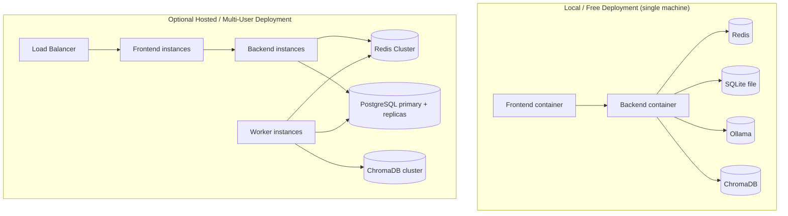
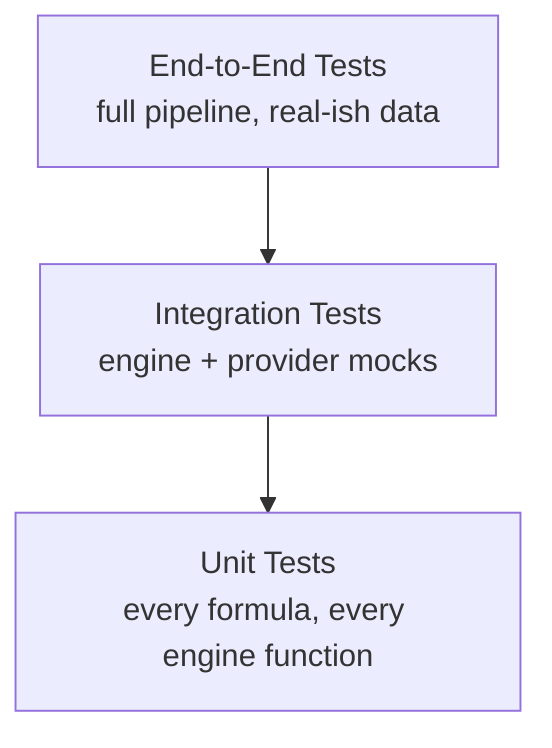

# InvestorGPT — Volume 6
## Infrastructure, Performance, Testing & Deployment

**Covers:** Part 17 (Infrastructure) · Part 18 (Performance Engineering) · Part 19 (Testing Strategy) · Part 20 (Deployment Guide)
**Previous:** `InvestorGPT_05_Algorithms_Implementation_Security.md` · **Next:** `InvestorGPT_07_Observability_Business_Roadmap_Appendices.md`

---

# Part 17 — Infrastructure

## 17.1 Deployment Topology

**Figure 6.1 — Deployment Topology (Local vs. Hosted)**



The architecture is identical in both cases — the **only** difference is configuration (database URL, number of worker replicas, presence of a load balancer). This is a direct consequence of the interface-based modularity principle (Volume 2, Part 5.6).

## 17.2 Docker Compose (Local Deployment)

```yaml
# docker-compose.yml
version: "3.9"
services:
  frontend:
    build: ./frontend
    ports: ["3000:3000"]
    depends_on: [backend]

  backend:
    build: ./backend
    ports: ["8000:8000"]
    env_file: .env
    depends_on: [redis, ollama, chromadb]

  redis:
    image: redis:7-alpine
    ports: ["6379:6379"]

  chromadb:
    image: chromadb/chroma:latest
    volumes: ["./data/chroma:/chroma/chroma"]

  ollama:
    image: ollama/ollama:latest
    volumes: ["./data/ollama:/root/.ollama"]
    ports: ["11434:11434"]
```

Bring the entire stack up with a single command:

```bash
docker compose up
```

## 17.3 Kubernetes (Optional, Future Scale)

```yaml
# k8s/backend-deployment.yaml (abbreviated)
apiVersion: apps/v1
kind: Deployment
metadata:
  name: investorgpt-backend
spec:
  replicas: 3
  selector:
    matchLabels: { app: investorgpt-backend }
  template:
    metadata:
      labels: { app: investorgpt-backend }
    spec:
      containers:
        - name: backend
          image: investorgpt/backend:latest
          envFrom:
            - secretRef: { name: investorgpt-secrets }
          resources:
            requests: { cpu: "500m", memory: "512Mi" }
            limits: { cpu: "2", memory: "2Gi" }
---
apiVersion: v1
kind: Service
metadata:
  name: investorgpt-backend-svc
spec:
  selector: { app: investorgpt-backend }
  ports:
    - port: 80
      targetPort: 8000
  type: ClusterIP
---
apiVersion: autoscaling/v2
kind: HorizontalPodAutoscaler
metadata:
  name: investorgpt-backend-hpa
spec:
  scaleTargetRef:
    apiVersion: apps/v1
    kind: Deployment
    name: investorgpt-backend
  minReplicas: 2
  maxReplicas: 10
  metrics:
    - type: Resource
      resource:
        name: cpu
        target: { type: Utilization, averageUtilization: 70 }
```

## 17.4 CI/CD Pipeline

```yaml
# .github/workflows/ci.yml (abbreviated)
name: CI
on: [push, pull_request]
jobs:
  backend-tests:
    runs-on: ubuntu-latest
    steps:
      - uses: actions/checkout@v4
      - uses: actions/setup-python@v5
        with: { python-version: "3.12" }
      - run: pip install -r requirements.txt
      - run: ruff check .
      - run: black --check .
      - run: pytest --cov=app --cov-report=xml

  frontend-tests:
    runs-on: ubuntu-latest
    steps:
      - uses: actions/checkout@v4
      - uses: actions/setup-node@v4
        with: { node-version: "20" }
      - run: npm ci --prefix frontend
      - run: npm run lint --prefix frontend
      - run: npm run build --prefix frontend
```

## 17.5 Infrastructure as Code (Terraform — Optional, Hosted Deployments Only)

For hosted deployments, infrastructure (VPC, managed Postgres, managed Redis, container orchestration) can be expressed in Terraform modules so environments are reproducible. **This is optional** — the mandatory free path (Volume 2, Part 4.8) never requires cloud infrastructure or Terraform at all. The example below provisions the minimum AWS footprint for a hosted multi-user deployment.

```hcl
# infra/terraform/main.tf (illustrative, abbreviated)
terraform {
  required_providers {
    aws = { source = "hashicorp/aws", version = "~> 5.0" }
  }
}

provider "aws" {
  region = var.aws_region
}

resource "aws_db_instance" "postgres" {
  identifier             = "investorgpt-postgres"
  engine                 = "postgres"
  engine_version         = "16"
  instance_class         = "db.t4g.small"
  allocated_storage      = 20
  db_name                = "investorgpt"
  username               = var.db_username
  password               = var.db_password
  skip_final_snapshot    = true
  publicly_accessible    = false
}

resource "aws_elasticache_cluster" "redis" {
  cluster_id           = "investorgpt-redis"
  engine               = "redis"
  node_type            = "cache.t4g.micro"
  num_cache_nodes      = 1
  port                 = 6379
}

resource "aws_ecs_cluster" "main" {
  name = "investorgpt-cluster"
}

resource "aws_ecs_service" "backend" {
  name            = "investorgpt-backend"
  cluster         = aws_ecs_cluster.main.id
  desired_count   = 2
  launch_type     = "FARGATE"
  task_definition = aws_ecs_task_definition.backend.arn
}

variable "aws_region"  { type = string, default = "us-east-1" }
variable "db_username" { type = string, sensitive = true }
variable "db_password" { type = string, sensitive = true }
```

```bash
# Standard apply workflow
cd infra/terraform
terraform init
terraform plan -out=plan.tfplan
terraform apply plan.tfplan
```

## 17.6 Disaster Recovery & Backup

**Table 6.1 — Disaster Recovery Strategy by Component**

| Component | Recovery Strategy |
|---|---|
| Analysis state | Resumable from last persisted `AnalysisState` (Volume 1, Part 2.4) — a crashed worker never loses more than its current task |
| Database | Scheduled backups (cron + `pg_dump` in hosted mode); SQLite file copy in local mode |
| Vector store | ChromaDB persisted to disk; re-buildable from source documents if lost |
| Reports | Stored on persistent volume; regenerable from the underlying analysis snapshot if lost |

```bash
#!/usr/bin/env bash
# scripts/backup_postgres.sh — scheduled via cron in hosted deployments
set -euo pipefail
TIMESTAMP=$(date +%Y%m%d_%H%M%S)
pg_dump "$DATABASE_URL" | gzip > "backups/investorgpt_${TIMESTAMP}.sql.gz"
find backups/ -name "*.sql.gz" -mtime +30 -delete   # retain 30 days
```

---

# Part 18 — Performance Engineering

## 18.1 Performance Targets (Recap)

**Table 6.2 — Performance Targets (Recap of Volume 2, Table 2.4)**

| Operation | Target |
|---|---|
| Company resolution | < 2s |
| Cached analysis | < 5s |
| New analysis | 10–30s |
| Dashboard render | < 300ms after data ready |
| Export generation | Background, non-blocking |

## 18.2 Parallelization Strategy

The Task Manager schedules independent branches of the dependency graph (Volume 2, Part 5.7) concurrently using `asyncio.gather` across I/O-bound provider calls, and offloads CPU-bound work (indicator/pattern computation over large OHLCV arrays) to a process pool to avoid blocking the event loop.

```python
# backend/app/orchestration/task_manager.py (excerpt)
import asyncio

async def run_independent_branch(tasks: list, executor):
    return await asyncio.gather(*(executor.run(t) for t in tasks))
```

## 18.3 Caching Tiers

1. **In-process memory** — hottest, short-lived (current request scope).
2. **Redis** — shared across workers, TTL-governed (Volume 4, Part 10.5).
3. **PostgreSQL/SQLite** — source of truth, never expires automatically.

A request checks tier 1 → 2 → 3 → external provider, in that order, only falling through when the faster tier misses or is stale.

## 18.4 Profiling & Bottleneck Analysis

- Each engine call is wrapped with timing instrumentation feeding the Observability Dashboard (Volume 7, Part 21.2).
- Slowest 1% of requests are sampled with full provider-call timing breakdowns to identify which provider or calculation is the bottleneck.

## 18.5 Local-Model Resource Considerations

**Table 6.3 — Local LLM Hardware Sizing**

| Model Size | Approx. RAM Needed (CPU inference) | Notes |
|---|---|---|
| 7B (e.g., Qwen2.5-7B) | ~8–10 GB | Good default for laptops |
| 14B | ~16–20 GB | Higher quality explanations, slower |
| GPU-accelerated (if available) | Varies by VRAM | Significantly faster generation |

The Model Router (Volume 3, Part 7.2) lets the deployment pick the largest model the host machine can comfortably run, without any application code change.

---

# Part 19 — Testing Strategy

## 19.1 Test Pyramid

**Figure 6.2 — Test Pyramid**



## 19.2 Unit Testing Example

```python
# backend/app/tests/engines/test_financial_engine.py
import math
from app.engines.calculation_engine import roe, current_ratio, cagr

def test_roe_basic():
    assert math.isclose(roe(net_income=341_000, shareholder_equity=1_000_000), 0.341)

def test_roe_zero_equity_returns_nan():
    assert math.isnan(roe(net_income=100, shareholder_equity=0))

def test_current_ratio_zero_liabilities_raises():
    import pytest
    with pytest.raises(ValueError):
        current_ratio(current_assets=100, current_liabilities=0)

def test_cagr_basic():
    assert math.isclose(cagr(begin_value=100, end_value=200, years=5), 0.1487, rel_tol=1e-3)
```

## 19.3 Integration Testing

Provider calls are mocked with recorded fixture responses (e.g., a captured Yahoo Finance JSON payload) so integration tests are deterministic and do not depend on live network access or rate limits.

```python
# backend/app/tests/integration/test_verification_engine.py
def test_verification_prefers_official_filing(mock_sources):
    mock_sources["official_filing"] = 120_300_000_000
    mock_sources["yahoo_finance"] = 128_000_000_000  # intentionally off

    result = verify_metric("revenue", mock_sources, TRUST_SCORES)

    assert result.source == "official_filing"
    assert result.value == 120_300_000_000
```

## 19.4 AI Evaluation Framework

A benchmark set of ~30–50 well-known companies with manually verified "golden" financial figures and known historical outcomes is used to evaluate:

**Table 6.4 — AI Evaluation Framework Metrics**

| Metric | What It Measures |
|---|---|
| Verification accuracy | % of golden metrics correctly verified and sourced |
| Hallucination rate | Must remain at 0% by construction (no LLM arithmetic), tested by adversarial prompts |
| Explanation faithfulness | Does the LLM's prose match the underlying verified numbers exactly? |
| Latency | p50/p95/p99 analysis time |
| Recommendation stability | Does re-running the same company with unchanged data produce the same recommendation? |

Every prompt-template change (Volume 3, Part 7.4) is benchmarked against this suite before being promoted; regressions block the release.

## 19.5 Regression & Load Testing

- **Regression:** the full benchmark suite (19.4) re-runs on every release candidate.
- **Load testing:** simulated concurrent `/analyze` requests (e.g., via Locust) validate that the Queue Manager and Worker Pool degrade gracefully (queueing, not failing) under load rather than crashing.

```python
# scripts/loadtest_locustfile.py
from locust import HttpUser, task, between

class AnalystUser(HttpUser):
    wait_time = between(1, 3)

    @task
    def analyze_known_company(self):
        self.client.post(
            "/api/v1/analyze",
            json={"query": "Analyze NVIDIA", "depth": "standard"},
            headers={"Authorization": f"Bearer {self.environment.parsed_options.api_key}"},
        )
```

## 19.6 Test Coverage Targets

**Table 6.5 — Test Coverage Targets by Layer**

| Layer | Target Coverage |
|---|---|
| Core Calculation Engine (formulas) | 100% |
| Verification / Rule Engine | ≥ 95% |
| Other engines | ≥ 85% |
| API routes | ≥ 80% |
| Frontend components | ≥ 70% |

---

# Part 20 — Deployment Guide

## 20.1 Environments

**Table 6.6 — Environment Matrix**

| Environment | Purpose | Database | LLM |
|---|---|---|---|
| Development | Local iteration | SQLite | Ollama, small model |
| Staging | Pre-release validation, benchmark suite run | PostgreSQL (single instance) | Ollama, production-sized model |
| Production | Live use (local single-user or hosted multi-user) | SQLite (local) / PostgreSQL (hosted) | Ollama (local or dedicated host) |

## 20.2 Local Setup (Step by Step)

```bash
git clone https://github.com/your-org/investorgpt.git
cd investorgpt
cp .env.example .env          # fill in optional free-tier API keys
docker compose up -d ollama
docker exec -it investorgpt-ollama-1 ollama pull qwen2.5:14b
docker compose up
# Frontend:  http://localhost:3000
# API docs:  http://localhost:8000/docs
```

## 20.3 Versioning & Release Strategy

Semantic versioning (`MAJOR.MINOR.PATCH`). A `MAJOR` bump implies a breaking API or database schema change; `MINOR` adds features/engines; `PATCH` is bug fixes and prompt-quality improvements only.

## 20.4 Rollback Procedure

1. Every release is tagged and its Docker images are immutable.
2. Database migrations (Alembic) are always written with a corresponding `downgrade()` step.
3. Rolling back = redeploy the previous image tag + run the corresponding migration downgrade, in that order.

## 20.5 Maintenance Runbook (Checklist)

- [ ] Confirm provider API keys/rate limits are still valid (free tiers occasionally change terms).
- [ ] Run the AI Evaluation Framework benchmark suite (Part 19.4) after any model or prompt change.
- [ ] Check Observability Dashboard (Volume 7, Part 21) for rising error rates or provider fallback frequency.
- [ ] Verify backup job completion (Part 17.6).
- [ ] Review Plugin Manager logs for any third-party plugin errors.

> **Continue to Volume 7** — `InvestorGPT_07_Observability_Business_Roadmap_Appendices.md` — for observability, business model, the expanded phased roadmap, and the appendices summary.
