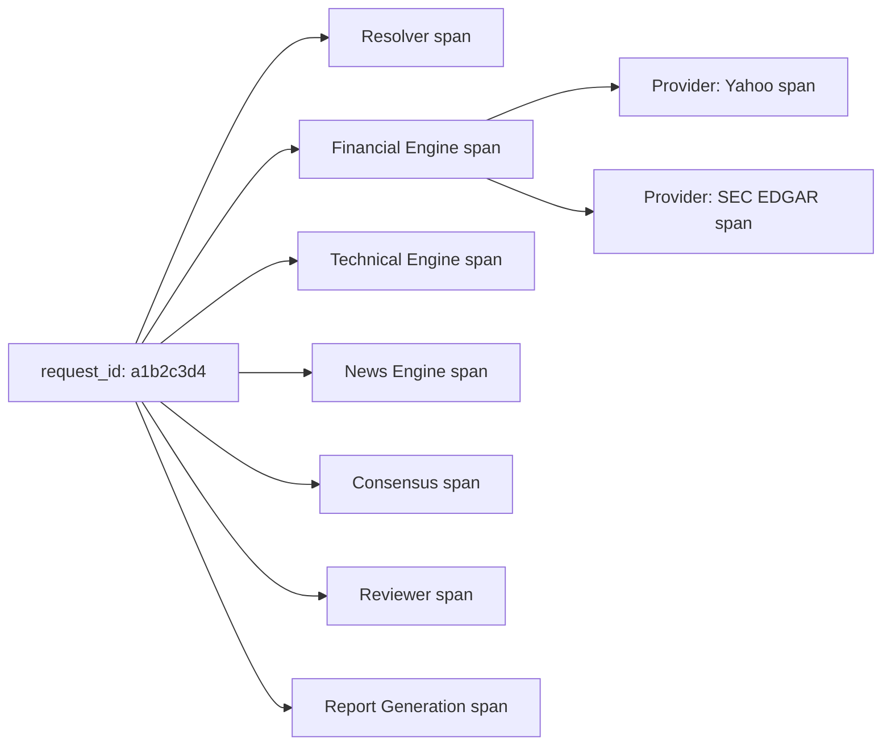
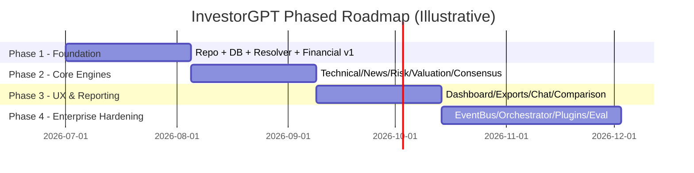

# InvestorGPT — Volume 7
## Observability, Business Model, Roadmap & Appendices

**Covers:** Part 21 (Observability) · Part 22 (Business Model) · Part 23 (Future Roadmap — Expanded) · Part 24 (Appendices Summary)
**Previous:** `InvestorGPT_06_Infrastructure_Performance_Testing_Deployment.md` · **Next:** `InvestorGPT_08_Glossary_Index_and_Extended_Reference.md`

---

# Part 21 — Observability

## 21.1 Logging Strategy

Structured (JSON) logs, one event per line, always carrying `request_id`/`analysis_id` for correlation across every agent, engine, and provider call.

```json
{"ts": "2026-06-26T10:15:02Z", "level": "INFO", "analysis_id": "f47ac10b", "component": "financial_engine", "event": "ratio_calculated", "metric": "roe", "value": 0.341, "duration_ms": 4}
```

**Table 7.1 — Log Level Usage**

| Level | Use |
|---|---|
| `DEBUG` | Intermediate calculation values, provider raw payload shapes |
| `INFO` | State transitions, task start/finish, cache hits |
| `WARNING` | Provider fallback triggered, stale data served, low-confidence result |
| `ERROR` | Provider exhausted all fallbacks, Reviewer Agent rejection, unrecoverable task failure |

## 21.2 Metrics

**Table 7.2 — Core Metrics Catalog**

| Metric | Type | Purpose |
|---|---|---|
| `analysis_duration_seconds` | Histogram | Latency tracking (p50/p95/p99) |
| `provider_fallback_total` | Counter | How often the primary provider fails |
| `cache_hit_ratio` | Gauge | Cache effectiveness |
| `consensus_agreement_score` | Gauge | How often engines agree vs. disagree |
| `reviewer_rejection_total` | Counter | How often the Reviewer Agent sends work back |
| `queue_depth` | Gauge | Backpressure / scaling signal |
| `llm_tokens_generated_total` | Counter | Capacity planning (Volume 3, Part 7.8) |

## 21.3 Tracing

Every request is assigned a `request_id` at the API boundary, propagated through the Event Bus (Volume 2, Part 5.3) into every engine and provider call, enabling full distributed-trace reconstruction of a single analysis from click to report.

**Figure 7.1 — Distributed Trace Shape for One Analysis**



## 21.4 Observability Dashboard

A dedicated internal dashboard surfaces:

- Active analyses and their current state,
- Average completion time (rolling 24h),
- Provider failure/fallback rates,
- Cache hit rate,
- Worker pool utilization,
- LLM generation latency,
- Reviewer Agent rejection rate (a rising trend here signals upstream data-quality issues).

## 21.5 Alerting & Incident Response

**Table 7.3 — Alerting Matrix**

| Trigger | Alert Severity | Response |
|---|---|---|
| All providers for a critical data type (e.g., market data) failing | Critical | Page on-call; check provider ToS/rate-limit changes |
| Reviewer rejection rate > 10% over 1h | Warning | Investigate recent prompt/model/data changes |
| Queue depth growing unbounded | Warning | Scale worker pool or investigate stuck tasks |
| Database backup job failure | Critical | Immediate manual backup + root-cause investigation |

---

# Part 22 — Business Model

> This section discusses *potential* paths for sustaining the project. It is descriptive analysis of options, not a committed business plan, and it does not change the mandatory requirement (Volume 2, Part 4.8) that the core platform must be fully buildable and runnable for $0.

## 22.1 Positioning

InvestorGPT's core identity is an **open-source, locally-runnable, free** investment research engine. This is a deliberate product decision, not a temporary launch discount — the architecture (interface-based providers, self-hosted LLMs, free-tier data sources) is built so the $0 path is permanently viable, not a bait-and-switch.

## 22.2 Potential Monetization Paths (Optional, Non-Core)

**Table 7.4 — Optional Monetization Paths**

| Path | Description |
|---|---|
| Hosted convenience tier | Pay for a managed instance (no local setup, managed uptime) — the same open-source code, just operated for the user |
| Premium data add-ons | Optional paid premium data feeds (e.g., higher-rate-limit market data) plugged in via the existing Provider interface |
| Enterprise support | Support contracts, custom plugin development, or compliance hardening for institutional users |
| Plugin marketplace | A revenue-share marketplace for third-party indicator/valuation/provider plugins (Volume 5, Part 15.5) |

None of these require any change to the free, local, self-hosted path — they are additive, optional layers consistent with the "everything replaceable" architecture.

## 22.3 Target Market Segments

**Table 7.5 — Target Market Segments**

| Segment | Why InvestorGPT Fits |
|---|---|
| Individual retail investors | Free institutional-style research, normally gated behind expensive terminals |
| Finance/CS students | "AI Learning Mode" turns every metric into a teaching moment |
| Indie developers / AI engineers | A reference architecture for verified, multi-agent, explainable AI systems — not just a finance tool |
| Small RIAs / boutique funds (with appropriate compliance review) | A starting point for internal research tooling, subject to their own regulatory obligations |

## 22.4 Cost Structure of the Free/Local Version

**Table 7.6 — Mandatory Cost Structure**

| Cost Category | Mandatory Spend |
|---|---|
| LLM inference | $0 (self-hosted via Ollama) |
| Market/financial data | $0 (free tiers: Yahoo Finance, SEC EDGAR, Stooq) |
| News/sentiment | $0 (Google News RSS, Reddit API free tier) |
| Macro data | $0 (FRED, World Bank) |
| Compute | User's own hardware |
| **Total mandatory cost** | **$0** |

## 22.5 Competitive Analysis

See Volume 1, Table 1.5 for the full feature comparison table against Bloomberg Terminal, Morningstar, and generic AI chatbots.

## 22.6 SWOT Analysis

**Table 7.7 — SWOT Analysis**

| Strengths | Weaknesses |
|---|---|
| Verified, multi-source, explainable data pipeline | Free-tier data sources have rate limits and occasional gaps versus paid terminals |
| Zero mandatory cost; fully self-hostable | Local LLM quality/speed depends on the user's hardware |
| Modular, plugin-extensible architecture | Larger surface area to build and maintain than a single-feature tool |
| Multi-agent consensus is more transparent than a single LLM verdict | International/non-US filing coverage is inherently less standardized than US SEC data |

| Opportunities | Threats |
|---|---|
| Plugin ecosystem could grow community-built indicators/valuation models | Free-tier provider terms of service could change or tighten |
| Educational angle (AI Learning Mode) opens a non-trading audience | Regulatory scrutiny if outputs are ever perceived as personalized advice |
| Open architecture invites contribution from finance + AI communities | Competing well-funded AI-finance products could move faster on UX polish |

## 22.7 Disclaimer (Repeated — Critical)

InvestorGPT, in any deployment, is a research and analysis **tool**, not a financial adviser. Recommendations such as "BUY," "HOLD," or "SELL," along with any fair-value estimate, investment score, or confidence percentage, are outputs of a software model based on historical and currently available data — they are not guarantees of future performance and do not account for any individual user's personal financial situation, risk tolerance, or goals. Any team that operates a hosted or commercial version of this system is responsible for ensuring compliance with the investment-adviser and securities regulations applicable in every jurisdiction it serves. The complete disclaimer language is also provided in Volume 8, Part 25.9.

---

# Part 23 — Future Roadmap (Expanded)

This roadmap restates each phase with concrete deliverables, exit criteria, and a relative effort estimate, so a solo developer or small team can use it as an actual sprint-planning input rather than a list of feature names.

## 23.1 Phase 1 — Foundation (MVP)

**Table 7.8 — Phase 1 Deliverables**

| Deliverable | Detail | Exit Criteria |
|---|---|---|
| Repo skeleton | Folder structure from Volume 4, Part 10.2; CI pipeline from Volume 6, Part 17.4 running on every push | CI green on an empty/scaffolded repo |
| Database schema v1 | `companies`, `analyses`, `financials` tables (Volume 4, Part 12.2) + Alembic migration | Migration applies cleanly to a fresh SQLite DB |
| Company Resolver Agent | Resolves ≥ 95% of a 50-company smoke-test list across US + 2 other exchanges | Smoke-test suite passes |
| Yahoo Provider | `get_price`, `get_financial_statements` implemented against the `MarketDataProvider` interface (Volume 2, Part 5.6) | Returns normalized data for the smoke-test list |
| Financial Engine v1 | Core ratio library (Volume 5, Part 14.3) fully unit-tested at 100% coverage | `pytest` coverage report confirms 100% on `calculation_engine.py` |
| Minimal dashboard | Search bar → `InvestmentScoreCard`-equivalent placeholder with real ratios | A user can type a ticker and see real, verified numbers |

**Relative effort:** 1 developer, 3–5 weeks, assuming familiarity with FastAPI/Next.js.

## 23.2 Phase 2 — Core Multi-Engine Analysis

**Table 7.9 — Phase 2 Deliverables**

| Deliverable | Detail | Exit Criteria |
|---|---|---|
| Technical Engine | Indicators from Volume 5, Part 14.7 + trend classification (Volume 1, supports FR-009) | Indicator values match a reference implementation (e.g., TA-Lib) within tolerance |
| News Engine | Ingestion + dedupe + categorization (Volume 1, supports FR-016) | Duplicate stories from 2+ outlets merge into one event in test fixtures |
| Risk Engine | Category scoring (Volume 1, supports FR-019/FR-020 context) | Each risk category cites at least one supporting data point |
| Valuation Engine (DCF + Comparables) | DCF per Volume 5, Part 14.5; Rule Engine rejects invalid assumptions | DCF rejects `terminal_growth >= wacc` automatically (unit test) |
| Consensus Engine + Reviewer Agent | `compute_consensus` (Volume 3, Part 6.4) + checklist (Volume 3, Part 6.5) wired into the pipeline | A deliberately contradictory test fixture is correctly rejected by the Reviewer |

**Relative effort:** 1–2 developers, 4–6 weeks.

## 23.3 Phase 3 — Professional Reporting & UX

**Table 7.10 — Phase 3 Deliverables**

| Deliverable | Detail | Exit Criteria |
|---|---|---|
| Full interactive dashboard | All components from Volume 4, Part 11.8 | Every headline metric opens an `EvidencePanel` |
| PDF/Excel/PPTX export | Background job via Queue Manager (Volume 4, Part 10.6) | Export completes without blocking the dashboard |
| AI Chat (report-scoped) | Grounded retrieval only from the current `analysis_id`'s stored data (Volume 1, FR-024) | Chat refuses to answer from outside the report's verified data |
| Comparison mode | `ComparisonTable` component + Comparison Service (Volume 4, Part 10.4) | Two companies render correctly side by side with aligned metrics |

**Relative effort:** 1–2 developers, 4–6 weeks.

## 23.4 Phase 4 — Enterprise-Grade Hardening

**Table 7.11 — Phase 4 Deliverables**

| Deliverable | Detail | Exit Criteria |
|---|---|---|
| Event Bus + Workflow Orchestrator + State Machine | Volume 2, Parts 5.3–5.4; Volume 1, Part 2.4 | A killed worker mid-analysis resumes correctly on restart |
| Queue Manager + Worker Pool | Volume 4, Part 10.6 | Load test (Volume 6, Part 19.5) shows queueing, not failure, under load |
| Plugin SDK + Plugin Manager | Volume 5, Part 15.5; worked example in Volume 8, Part 27.4 | A third-party indicator plugin loads and runs with zero core-file edits |
| Evaluation Framework + Rule Engine | Volume 6, Part 19.4; Volume 2, Part 5.8 ADR-001 | Benchmark suite blocks a regressive prompt/model change automatically |
| Knowledge Graph Engine + GraphRAG | Volume 3, Part 9.5–9.6 | Supply-chain risk propagation test (Taiwan→TSMC→NVIDIA) passes |

**Relative effort:** 2–3 developers, 6–10 weeks.

## 23.5 Long-Term Vision

- **Living Research Workspace** — every company becomes a persistent, continuously updated notebook rather than a one-off report (Volume 1, Vision; Volume 3, Part 8.6).
- **Investment Decision Tracker** — every recommendation is archived with its assumptions and later compared against actual outcomes, building a measurable, transparent accuracy track record over time (extends the Evaluation Framework, Volume 6, Part 19.4).
- **Portfolio-aware analysis** — every single-company analysis is automatically contextualized against the user's broader holdings (Portfolio Engine, Volume 3, Part 6.1).
- **Multi-language / multi-market depth** — first-class normalization for non-US accounting standards and fiscal calendars beyond the initial US-centric data sources.
- **Community plugin marketplace** — building on the Plugin SDK (Volume 5, Part 15.5) toward a reviewed, versioned registry of third-party indicators, valuation models, and providers.

**Figure 7.2 — Roadmap Timeline Overview**



---

# Part 24 — Appendices (Summary)

The full appendices — comprehensive glossary, sample prompt library, extended multi-language code appendix, master figure index, master table index, and references/bibliography — have been moved to a dedicated volume to keep this volume focused on observability/business/roadmap and to give the reference material room to be genuinely complete:

> **Continue to Volume 8** — `InvestorGPT_08_Glossary_Index_and_Extended_Reference.md`

A short pointer summary of what's there:

**Table 7.12 — Volume 8 Contents Pointer**

| Part | Contents |
|---|---|
| 25 | Full Glossary — 60+ financial, technical-analysis, and AI/agent terms |
| 26 | Sample Prompt Library — 6 fully worked prompt templates |
| 27 | Extended Code Appendix — additional TypeScript, Node.js, Terraform, GraphQL, and SQL examples, plus a worked third-party plugin and ADR template |
| 28 | Master Figure Index — every numbered figure across all 8 volumes |
| 29 | Master Table Index — every numbered table across all 8 volumes |
| 30 | References & Bibliography — every data source and standard referenced in this suite |
