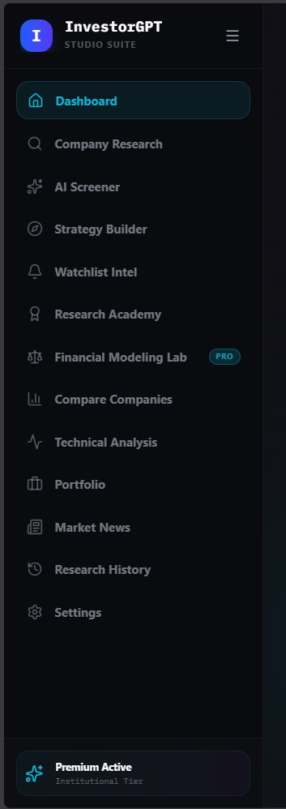
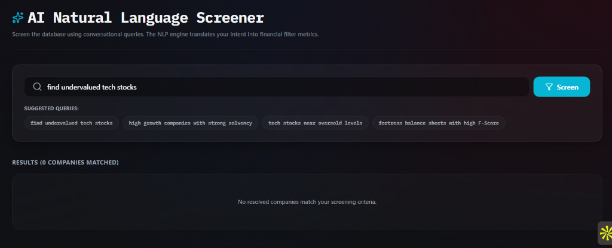
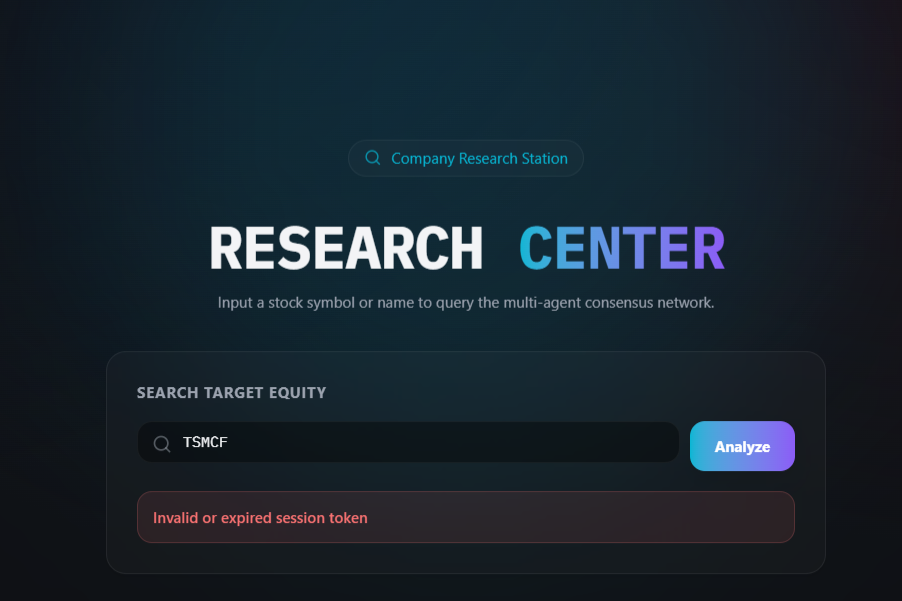
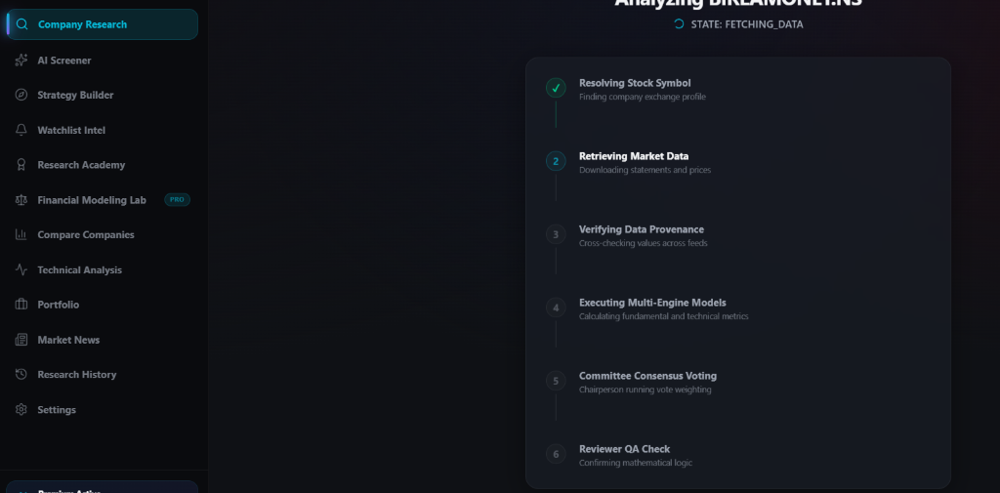
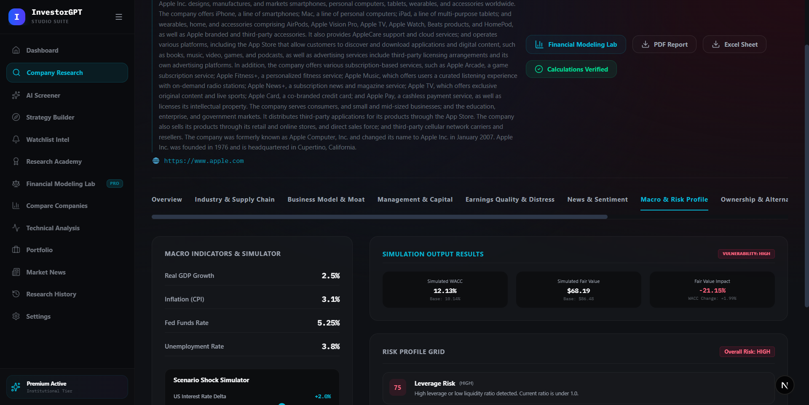
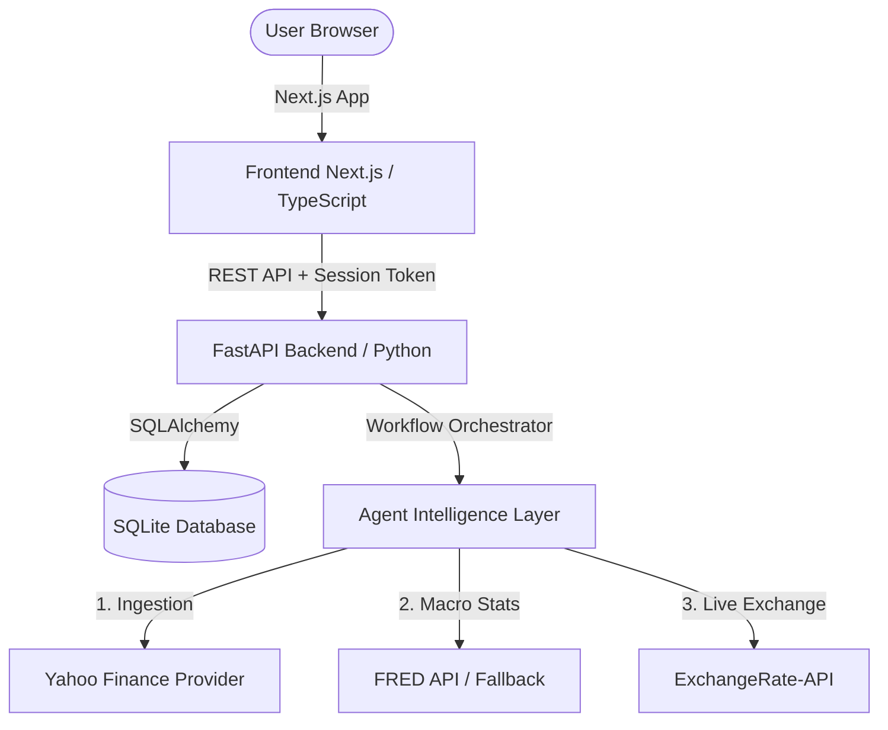

# InvestorGPT — Autonomous Multi-Agent Investment Research & Portfolio Optimization Platform

InvestorGPT is an advanced, multi-tenant investment research platform powered by an explainable multi-agent system. It integrates real-time market data ingestion, economic scenario modeling, Piotroski F-Score & Altman Z-Score solvency calculation, discounted cash flow (DCF) valuation sheets, technical indicators, and a Modern Portfolio Theory (MPT) optimization studio.

---

## 🚀 Core Features & Interface Preview

### 1. User Authentication & Multi-Tenant Security
A secure access gateway that protects user data isolation across all platform tools.
* **PBKDF2 Hashing**: Custom password encryption and verification without external binary dependencies.
* **Session Token Expiry Guards**: Automatic token validations that dynamically clear credentials and redirect to login when sessions expire.
* **Database Row Isolation**: All chats, history, portfolios, and watchlists are strictly scoped to the active `current_user.id`.



---

### 2. Company Research Notebook & Grounded Chat
Run detailed multi-agent analyses on any global stock ticker.
* **Workflow Orchestration**: Triggers background pipelines (Ingestion, Financials, Ratios, DCF, Technicals, News Sentiment, FRED Macro Stats).
* **Consensus & Reviewer Agents**: Synthesizes conflicting signals using weighted scores and performs human-like metric validation.
* **Grounded Chat**: An isolated interactive assistant loaded with the final report's verified context to answer questions.



---

### 3. AI Natural Language Screener
Filter the global stock market using conversational financial criteria.
* **NLP Search**: Processes queries like *"undervalued tech stocks"* or *"fortress balance sheets with high F-Score"*.
* **Live Global Stock Discovery**: Dynamically parses the search query, fetches matches from Yahoo Finance Search, and registers new assets into the local SQLite catalog.
* **Dynamic Currency Display**: Automatically formats pricing cards using native currency symbols (e.g. `₹` for NSE and `$` for NYSE/NASDAQ).



---

### 4. Portfolio Tracker Playground
Track equity holdings and calculate entry points dynamically.
* **Multi-Currency Conversions**: Displays cost basis, value, and P&L in USD, INR, EUR, GBP, or JPY using live exchange rates with 1-hour cache.
* **Dynamic Document Export**: Exports portfolio ledgers directly to print-ready PDF and Excel worksheets.
* **Vibrant SVG Ring**: High-contrast donut charts representing weight allocations.


---

### 5. Portfolio Optimization Studio (MPT)
A professional-grade portfolio rebalancing simulator based on Modern Portfolio Theory.
* **Efficient Frontier Scatter Plot**: Simulates 500 configurations, mapping expected returns against annualized volatility.
* **Max Sharpe & Min Volatility Targets**: Evaluates optimal target weight configurations.
* **Asset Correlation Heatmap**: Color-coded correlation grid (red for positive, blue for negative/offsetting hedges) to ensure smart diversification.


---

### 6. Technical Analysis Dashboard
Interactive panels displaying advanced technical momentum indicators:
* **Chart Overlays**: 20-day/50-day Simple Moving Averages, Bollinger Bands with Squeeze Alerts, and Ichimoku Clouds.
* **Momentum Ratios**: RSI (14-day) oversold/overbought signals, MACD (Line, Signal, Histogram), and Average Directional Index (ADX) trends.



---

### 7. Financial Modeling Lab
A sandbox environment for running economic stress tests and sensitivity analyses.
* **Macro Scenarios**: Shock interest rates, inflation, or crude oil prices, and trace the downstream impacts on company EBIT margins.
* **Three-Statement Models**: Dynamically recalculates income statements, balance sheets, and cash flows.
* **DCF Sensitivity Grids**: Computes fair value matrices under varying growth and WACC conditions.



---

## 🛠️ Tech Stack & Architecture



* **Frontend**: Next.js 16 (App Router), TypeScript, TailwindCSS, Lucide Icons, Custom SVGs.
* **Backend**: FastAPI, Python 3.12+, SQLAlchemy, Uvicorn.
* **Data Layer**: SQLite Database (local dev/production file), `yfinance` & `httpx` (live fetches).

---

## ⚡ Setup & Local Installation

### Prerequisites
* Python 3.12+
* Node.js 18+
* npm or yarn

### 1. Configure Environment Variables
Create a `.env` file in the root directory (based on `.env.example`). **Never commit this file or expose real API credentials on GitHub.**
```env
FRED_API_KEY="YOUR_FRED_API_KEY"
FINNHUB_API_KEY="YOUR_FINNHUB_API_KEY"
```

### 2. Start the Backend Server
```bash
cd backend
python -m venv venv
# Windows
.\venv\Scripts\activate
# Linux/macOS
source venv/bin/activate

pip install -r requirements.txt
uvicorn app.main:app --reload --port 8000
```
* The backend will run on `http://localhost:8000`.
* On startup, the database auto-seeds 30 global and Indian companies (Amazon, NVIDIA, Reliance, TCS, HDFC, etc.) to immediately populate the Screener and Modeling Labs.

### 3. Start the Frontend Server
```bash
cd frontend
npm install
npm run dev
```
* The frontend dashboard will run on `http://localhost:3000`.
