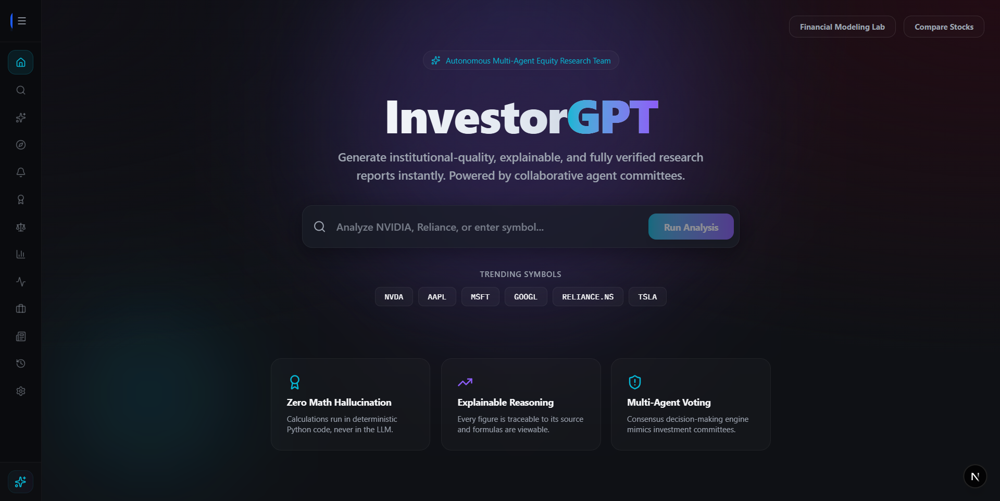
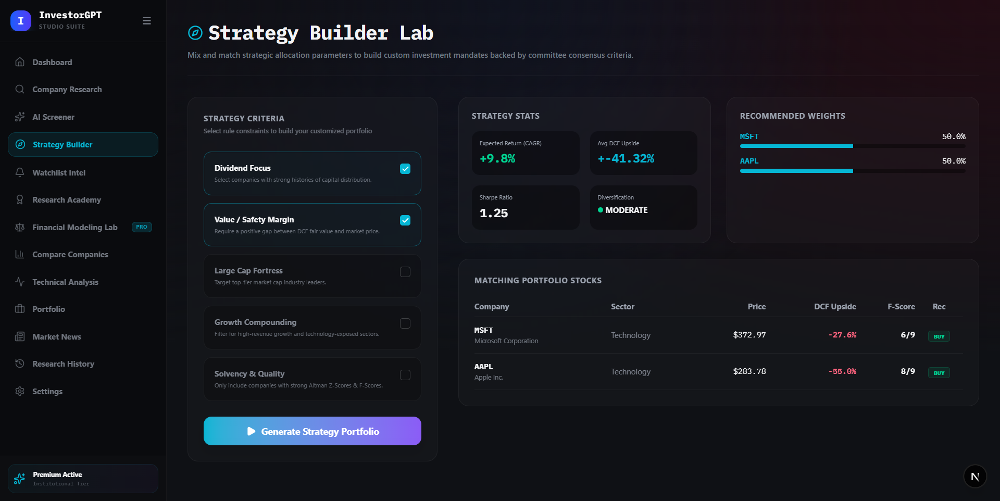

# Portfolio Tracker Playground & Optimization Studio

InvestorGPT features a robust, multi-tenant, and multi-currency **Portfolio Tracker Playground** integrated directly with a **Modern Portfolio Theory (MPT) Optimization Studio**. This system enables users to monitor live asset allocations, calculate entry cost bases, dynamically switch display valuations across multiple global currencies, and run Monte Carlo simulations to plot the **Efficient Frontier**.

---

## 1. Overview & Dynamic Summary Cards
The dashboard header presents an instant snapshot of your capital allocation. It calculates:
* **Portfolio Value**: Combined valuation of all active equity holdings, priced in real-time.
* **Total Cost**: Total purchase price of all acquired holdings.
* **Total Gains / Loss**: Absolute monetary profit or loss.
* **Return Percentage**: Capital appreciation percentage.

### Multi-Currency Display Support
Using live conversion rates sourced from the **ExchangeRate-API** (with a 1-hour in-memory cache), you can toggle the portfolio display currency across:
* **USD ($)**
* **INR (₹)**
* **EUR (€)**
* **GBP (£)**
* **JPY (¥)**

All values and labels dynamically update across the page, while secondary grey rows maintain visibility of original native purchase figures for cross-border investments.

---

## 2. Asset Allocation & SVG Weight Ring
The **Allocation & Holdings** tab visualizes the composition of your portfolio:
* **SVG Weight Ring**: A dynamic vector chart showing holding weights (e.g. AAPL, MSFT, RELIANCE.NS) utilizing a vibrant, high-contrast color scheme.
* **Asset Holdings Table**: A granular ledger detailing:
  * Number of Shares
  * Average Buy Price (with native vs display currency indicators)
  * Current Market Price (timeout-protected fetches)
  * Total Cost & Current Value
  * Percentage P&L with color indicators

---

## 3. MPT Optimization Studio (Efficient Frontier)
The **Optimization Studio** leverages Modern Portfolio Theory to simulate optimal asset allocations based on historical covariance and risk/return profiles.

### A. Efficient Frontier Scatter Plot
Runs a Monte Carlo simulation of 500 distinct portfolio configurations, plotting their annualized expected return against annualized volatility (risk).
* 🟡 **Max Sharpe Ratio Portfolio (Gold Star)**: The allocation maximizing return per unit of risk:
  $$\text{Sharpe Ratio} = \frac{E(R_p) - R_f}{\sigma_p}$$
* 🔵 **Min Volatility Portfolio (Cyan Diamond)**: The allocation minimizing overall portfolio variance.

### B. Asset Correlation Matrix
Presents a color-coded grid representing the statistical correlation coefficient ($r$) between assets. 
* Positive correlations are highlighted in soft red, indicating assets that move in tandem.
* Diversifying negative correlations are highlighted in blue, representing risk-offsetting hedges.

### C. Optimal Target Allocations
Provides side-by-side weight breakdowns comparing the Max Sharpe and Min Volatility models, guiding users on rebalancing actions.

---

## 4. Features & Integrations
* **Dynamic PDF & Excel Export**: Generate formatted spreadsheets and print-ready reports containing your active portfolio.
* **Security & Isolation**: Scopes transactions and calculations strictly to the authenticated `current_user.id` to prevent cross-user leakage.
* **Unified Autocomplete**: Built-in suggestion inputs to instantly resolve ticker symbols globally (NYSE, NASDAQ, NSE, LSE).
* **Fault-Tolerant Queries**: Wrapped in strict 5-second async timeouts to ensure the page never hangs if public data providers suffer downtime.
